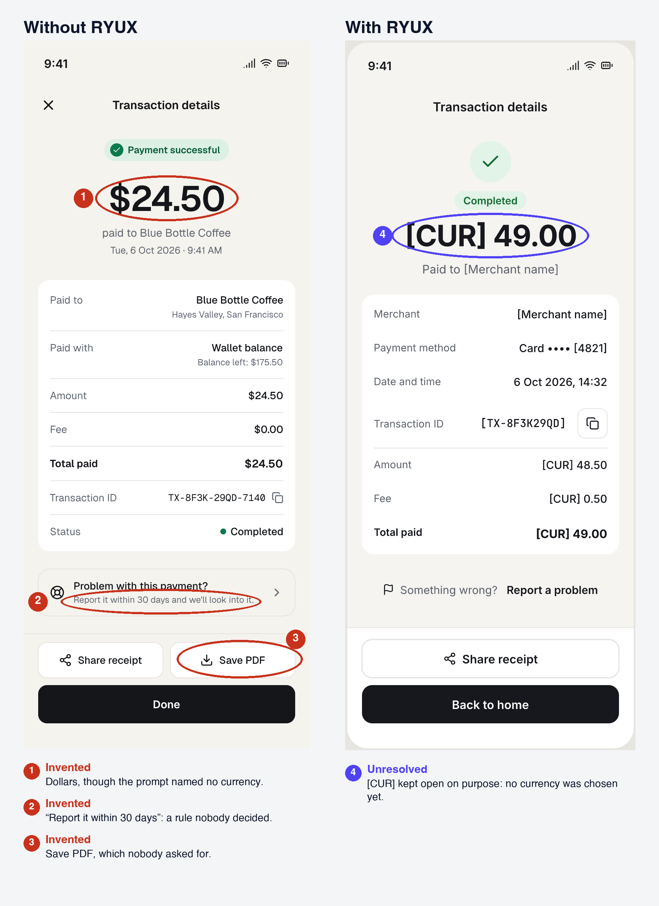

<p align="center">
  <a href="LICENSE"></a>
  
</p>

# RYUX

**Design intelligence for AI. Understand before you design.**

RYUX is a skill for AI coding and design agents. Before the agent designs, it works out what it
knows, what it is guessing, and what nobody told it. Then it decides, and keeps the open questions
visible instead of filling them in.

**[Get started](#get-started)** · **[See the difference](#see-the-difference)** · **[ryux.design](https://ryux.design)**

## The problem

AI can generate an interface in seconds. The hard part is everything around it: what the screen
should contain, which states it needs, which rules are real, and which details were never decided.
A fast answer fills those gaps silently, so the result looks finished and is partly made up.

```
Without RYUX    prompt → generate → hope it makes sense
With RYUX       context → evidence → reasoning → decision → interface → critique → QA
```

## See the difference

Same prompt, same agent, one with RYUX:
*"Design a transaction detail page for a fintech app, shown after the user pays. Make it in pen.dev."*

<a href="assets/compare/en-states/compare-marked.png"></a>

- **Invented.** Without RYUX, the agent asked nothing and chose dollars, a 30-day reporting rule,
  and a Save PDF button. Nobody decided any of that, and it would ship looking as if someone had.
- **Unresolved.** With RYUX, the agent asked three questions first. The currency stays `[CUR]` on
  purpose: no market was chosen, so the placeholder marks a decision that is still open, not an
  unfinished design. It also flagged its fee rule as an assumption to confirm.
- **Missing.** Without RYUX, only the success state was designed. With RYUX, the agent also covered
  the states this screen really has: processing, failed, loading, a load error, and a narrow width
  ([see the full board](docs/benchmarks/en-td-2.3.3/b2/output.png)).

More screens is not the goal; a simple product may need one. The point is that the states a screen
really has are covered, and nothing undecided is filled in.

Repeated three times, the pattern held: without RYUX, dollars assumed in 3 of 3 runs, a made-up
business rule in 2 of 3, features nobody asked for in 3 of 3, and only the success state. With
RYUX, none of those, and the same five extra states each time. It also showed its own limits: every
RYUX run stated that the page updates live, and flagged that as an assumption to confirm.
Fresh agent per run, same model, no reference screens. A small benchmark, not a study.
[Every run and the full method](https://ryux.design/benchmarks).

The goal isn't more UI. It's fewer decisions made silently.

### What about visual quality?

That's a separate question, and RYUX hasn't proven it yet. In blind tests of a wallet home screen,
RYUX and the plain agent scored about the same, and both leaned on the same default fonts and
colors. We're testing changes against those defaults with human designers and will publish the
result either way. [Visual benchmarks](https://ryux.design/benchmarks#wallet-home).

## Decisions come with a receipt

For each major choice, RYUX writes down what it decided and how sure it is. This one is quoted from
the run above:

```
Decision     Amount + Fee = Total paid, shown in the card
Evidence     None
Confidence   Low
Assumption   [CONFIRM] The fee is charged on top of the amount.
             If the fee is taken out of the amount instead, the rows change.
```

A guess stays a guess. When there is no evidence, the receipt says so, and the person reviewing the
design knows exactly what to confirm. The format is guidance RYUX follows, not a fixed output.

## Know what you know

RYUX keeps three kinds of information apart:

- **Known**: observed in the design or its values, or backed by a cited pattern or standard.
- **Inferred**: a reasonable conclusion, stated as one.
- **Unknown**: not available. It stays visible, like `[CUR]`, instead of being invented.

That is the whole idea: missing information should not turn into confident-looking UI.

## How it works

You tell the agent what you are doing. RYUX picks the step and reads only the design knowledge that
step needs.

- **Analyze**: understand the existing interface, its context, and its constraints.
- **Design**: turn context and evidence into UX, UI, visual, and motion direction.
- **Build**: implement the decisions in your stack without inventing rules, data, or API behavior.
- **Critique**: find what should change first, with the reason and a fix.
- **QA**: check the build against the intended design at each width and state.

Every task ends with a check of what was verified and what was not.

**Visual direction is part of Design.** Illustration, iconography, imagery, ornament, and motion
start from a purpose and a brief: what the visual should communicate and what to avoid. Don't make
it look less AI. Make it look more intentional.

**DESIGN.md gives RYUX your project's direction.** `ryux setup` asks a few questions about product,
current work, audience, market, constraints, design intent, and UX, UI, and motion direction. Each
offers plain choices, your own answer, or Skip, and the answers go into a short block in DESIGN.md.
RYUX reads it before it designs, follows it as direction (not evidence), and treats blanks as unknown.

```
prompt → DESIGN.md → design knowledge → evidence → decisions
```

## Using RYUX

You don't need a special prompt. Say what you are making, in your own words:

```text
Design a transaction detail page for our app.
```

RYUX checks whether that is enough. It reads DESIGN.md and what the project already shows, and asks
only the questions whose answers would change a major decision, at most three and often none. Then it
designs.

More context gives a better start. Good input answers some of these:

- What are we making?
- Who is it for?
- What should the user accomplish?
- What constraints already exist?
- What evidence do we have: screens, research, data?

Don't know something? Leave it out. RYUX asks when it matters.

A short request, a request with context, and a request with your own screens and research all use
the same RYUX. RYUX doesn't just answer the prompt. It checks whether the prompt is enough.

## Get started

```bash
npx @ryuxdsgn/ryux
```

It asks which agents you use, installs RYUX, then offers a short project setup that writes
DESIGN.md. Run `npx @ryuxdsgn/ryux setup` again any time to change the answers.

Any agent, through [skills.sh](https://skills.sh):

```bash
npx skills add ryuxdsgn/design-intelligence
```

As a Claude Code plugin, inside Claude Code:

```text
/plugin marketplace add ryuxdsgn/design-intelligence
/plugin install ryux@design-intelligence
```

RYUX works on its own. Reference screens come from the RYUX MCP server, which you can run locally
today (`pnpm dev:mcp`). The hosted server at `mcp.ryux.design` is not live yet.

The [guide](GUIDE.md) covers other agents, global installs, updates, and the MCP setup.

### Reference data

RYUX may use reference screens and product evidence during analysis. Private reference data is not
included in this repository. The open-source repository contains the schemas, rules, and tooling used
to work with evidence, not private source material.

<details>
<summary><b>Technical details</b></summary>

### What gets installed

One skill folder, `ryux/`: a router (`SKILL.md`) that picks the step, five capability files, and
the knowledge modules those steps read. Rules have levels (Required, Preferred, Contextual) and a
few Hard Gates that are never waived, such as no invented numbers and no missing critical states.
Browse them in [`skills/ryux/`](./skills/ryux) and [`docs/design-rules.md`](./docs/design-rules.md).

### MCP tools

Nine tools: research (`search_screens`, `get_flow`, `get_local_pattern`, `compare_apps`,
`extract_design_direction`) and review (`audit_ui`, `audit_copy`, `heuristic_eval`,
`delivery_gate`). See [`apps/mcp/README.md`](./apps/mcp/README.md).

### Repository

```
apps/mcp/         MCP server (Cloudflare Workers)
apps/web/         ryux.design (Next.js)
packages/core/    shared tool logic
packages/cli/     the ryux CLI (npx @ryuxdsgn/ryux)
skills/ryux/      the RYUX skill, generated from packages/cli/src
docs/             design rules, taxonomy, showcase
```

```bash
pnpm install
pnpm dev:mcp        # MCP server on http://localhost:8787/mcp
pnpm dev:web        # ryux.design on http://localhost:3000
pnpm typecheck
```

### Further reading

- [GUIDE.md](GUIDE.md): install, MCP, and how RYUX reasons
- [docs/design-rules.md](docs/design-rules.md): every rule, level, and gate
- [docs/showcase.md](docs/showcase.md): the proof, every raw run, and the history
- [DEPLOY.md](DEPLOY.md): run your own instance (database, MCP server, website)

</details>

## Status

RYUX 2.5, early access, free. Available now: the skill, the CLI, skills.sh, the Claude Code plugin,
and the MCP server run locally. Coming: the hosted MCP and a larger reference library.

## Contributing, security, license

Issues and pull requests are welcome on [GitHub](https://github.com/ryuxdsgn/design-intelligence).
Rules and skills are generated from `packages/cli/src`; run `pnpm sync:skills` after changing them.
To report a vulnerability, see [SECURITY.md](./SECURITY.md).

**MIT**, © 2026 ryux.design (see [LICENSE](./LICENSE)). The code and the RYUX skill are covered by
this license. The reference data and the hosted service are separate.

Assets in this repository are synthetic outputs and illustrations created for RYUX experiments and
its website, unless otherwise noted. Brand names may appear as text in mock interfaces and do not
indicate affiliation.
