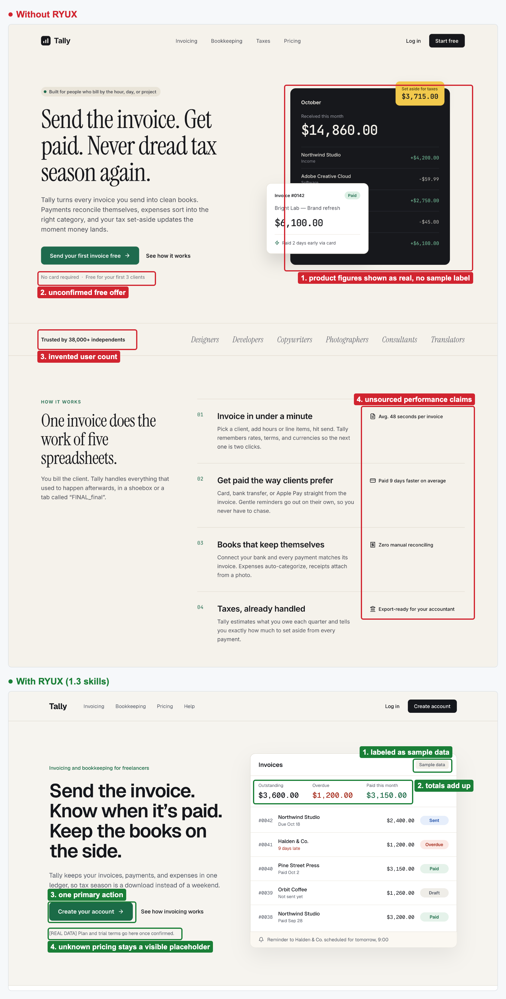

<p align="center">
  <a href="LICENSE"></a>
  
  
  
</p>

# RYUX: design intelligence

> **Understand before you design.**
>
> AI can generate an interface in seconds. RYUX makes it understand what it is building first.

RYUX helps AI agents and designers analyze, design, build, critique, and verify digital interfaces
using design knowledge and evidence.

```
Analyze → Design → Build → Critique → QA
```

**[Install](#install)** · **[See the demo](#see-it)** · **[GitHub](https://github.com/ryuxdsgn/design-intelligence)**

## What can I do with RYUX?

Give RYUX a screenshot, a Figma or pen.dev design, a URL, or a problem. Tell it what you are doing;
it picks the knowledge it needs.

**Analyze**: understand an interface that exists.

→ layout and hierarchy → patterns → states → design language → evidence kept apart from assumptions

**Design**: turn understanding into design decisions.

→ UX direction → UI direction → visual direction → interaction → motion → responsive behavior

**Build**: turn the decisions into an implementation in your stack.

→ components → layout → interaction → states → responsive UI

**Critique**: find what to fix before shipping.

→ evidence → impact → recommendation → severity → confidence

**QA**: verify the implementation against the design.

→ visual mismatches → missing states → responsive issues → Delivery Gate

## See the difference

Same prompt. Different reasoning.

Each brief below ran headless (`claude -p`) in an empty folder, once without RYUX and once with the
RYUX installed by the CLI (`npx @ryuxdsgn/ryux`), using earlier RYUX releases; [the showcase](docs/showcase.md) lists the exact version behind each image. The agent chose which skills to load.
Neither run had the RYUX MCP, so no reference screens were used. The screenshots are the agents' real
output, not edited by hand. The colored boxes are annotations added afterwards.

### UI

*"Design only the hero section of a landing page, 1440 wide by 900 tall, for RYUX: a design
intelligence layer for AI coding agents and designers. It installs as skills into Claude Code,
Cursor, Codex, and other agents (npx @ryuxdsgn/ryux), and an MCP server gives agents reference
screens from real apps as evidence. The hero should feature a custom illustration; create it with
pen.dev's Generate function."* Both runs designed in pen.dev and generated their illustration with
pen.dev's `Generate`.

<a href="assets/compare/ui/compare.png"></a>

Both heroes now have a generated illustration, and the difference is what it says. Without RYUX,
the illustration is the category default: floating screens wired to a terminal, plus a sparkle.
The page also invents a GitHub star count and lists an agent the brief never named (RX-AS-01,
RX-PR-02).

With RYUX, the illustration shows the product's own idea: a design under review, with numbered
marks, backed by pinned reference screens (RX-UI-07, RX-UI-12). It is captioned as a figure, so
nobody reads it as a real screen, and there is one primary action (RX-PR-03). The brief was the same
for both runs. Both agents ended their sessions while the illustrations were still generating,
because generation is asynchronous, so we exported both frames once the illustrations arrived,
without changing anything.

### Code

*"Write a TypeScript module, order-total.ts, that calculates an order total with shipping, a service
fee, and sales tax, and formats it as currency for the user's locale."*

<a href="assets/compare/code/compare.png"></a>

Both versions use integer cents and Intl formatting. The difference is what they decide on their
own. Without RYUX, the module adds pricing rules nobody asked for and quietly decides that shipping
and fees are never taxed (RX-AS-06, RX-PR-02). With RYUX, it builds only the named charges and makes
taxability a required input, because it differs by jurisdiction. It also left out Rupiah formatting,
since no market was named, and offered to add it (RX-PR-05).

### Copy

*"Our product is Tally, an invoicing app for freelancers. Write an in-app announcement and a short
email telling existing customers about a new feature: scheduled invoices."*

<a href="assets/compare/chat/compare.png"></a>

Both read well. Without RYUX, the copy describes a product nobody specified: a time picker, a
delivery notification, an arrow menu next to Send, and a Scheduled tab (RX-PR-02, RX-AS-07). With
RYUX, unknown labels and links stay placeholders (RX-AS-03), and the open question about plans is
flagged for the team.

Earlier examples, including the Indonesian-market set (QRIS, Rupiah, WhatsApp), are in
[`docs/showcase.md`](docs/showcase.md#indonesian-market-examples).

## See it

One screen through the whole loop. Every step below is a real agent run with RYUX installed,
quoted as it came out.

**"Analyze this hero, then critique it."** The input is a hero that an agent without RYUX designed.
RYUX inventoried it, then reported 12 findings. The top three are severity 3: unsourced numbers
(RX-AS-01), real app names on drawn screens presented as findings (RX-UI-07), and tertiary text at
3.98:1, below WCAG's 4.5:1 (RX-A11Y-01).

**"Now improve it."** RYUX compared three directions and chose a "design receipt" as the
signature (RX-UI-12). The redesign removes the numbers, labels the session as an example, uses app
categories instead of names, and fixes the contrast.

<a href="assets/compare/demo/compare.png"></a>

**"Build it."** RYUX built the redesign as one HTML and CSS file from the pen.dev frame's exact
values, responsive down to 390 wide. Links the design did not specify point to `#` instead of
invented URLs.

**"QA it."** RYUX compared the renders with the design: a close match at 1440, with one deviation
(rows 22px apart where the design says 27px), and three defects at 390, where no design existed.
Its Delivery Gate said FAIL until two one-line CSS fixes are made, and listed what it did not
check: hover, focus, and the Copy states.

<a href="assets/compare/demo/qa.png"></a>

**What it missed, and what we changed.** The made-up tool name `find_references` survived the
first critique; RYUX's real tool is `search_screens`. RYUX 2.1 added a fact check to Critique, and
on the same screen Critique 2.1 listed `find_references` as its first finding, marked
"contradicted".

```bash
npx skills add ryuxdsgn/design-intelligence
```

## Why RYUX

Most AI design tools start generating too early. RYUX starts by understanding the problem, the
interface, the context, and the evidence available.

RYUX is not another UI generator. It does not start with "make me a beautiful dashboard". It starts
with: what are we designing, why, and what evidence do we have? When there is none, it says so
instead of inventing a reference.

```
Without RYUX:  prompt → generate → generic UI → invented content → missing states
With RYUX:     context → analyze → evidence → reason → design → build → critique → QA
```

| Without RYUX | With RYUX |
| --- | --- |
| UI straight away | Analyze what exists first |
| Invented numbers, users, and features | Evidence: observed, inferred, or a cited pattern, and "None" when there is none |
| The category's default layout | Three directions compared, one chosen for a reason |
| A happy path only | Every state and width, rendered and checked |
| "Done" | A Delivery Gate that says what was not checked |

### What makes it different

- **Evidence over taste.** Every result carries a `screen_id`, app name, version, and capture date. A design decision points at a real screen, or it is marked as a judgment call.
- **Honest about what it knows.** RYUX rates its evidence and reports what it did not check. It never claims "pixel perfect" or "fully accessible" without proof.
- **Human judgment.** Designer notes explain why a flow works and where it falls short. People write them, not AI, and they are the most valuable part of the library.
- **Local depth where global libraries are thin.** The first market covered is Indonesia: QRIS, virtual accounts, WhatsApp OTP, paylater, and e-KYC.
- **Its own ruleset.** RYUX's rules (IDs start with `RX-`) are original work, MIT-licensed, with no third-party rule dependencies.

## Design knowledge, not just design rules

RYUX can work from curated references: real product screens, flows, local patterns, observations,
and designer notes. This is RYUX Knowledge, the evidence layer. Each entry keeps what was seen
apart from what it means:

```
Interface (screen_id) → Observation (what it visibly does) → Why it works or not (designer note)
  → Context (market, category, flow) → Pattern (observed in N screens across M apps) → Design implication
```

- **References**: real product screens and flows, each with a `screen_id`, app, version, and capture date.
- **Observations**: what a screen visibly does, drafted by AI and confirmed by a person.
- **Patterns**: when a pattern is useful, its risk, and where it was observed. An observed pattern, never a "best practice".
- **Designer notes**: why a flow works and where it falls short, written by people, never generated.

Agents reach it through the RYUX MCP (`search_screens`, `compare_apps`, `get_local_pattern`), and
RYUX keeps three sources apart: "I observed this", "I inferred this", and "this is a known pattern".

It is being built first with Indonesian products (fintech, e-commerce, government, telco, and SaaS),
because that is where global libraries are thinnest: QRIS, virtual
accounts, WhatsApp OTP, paylater, e-KYC, and Rupiah formats. Knowledge is in pilot: the capture and
review pipeline works, the library is still small, and the hosted MCP is not live yet. Without it,
RYUX says the evidence is "None" instead of inventing a reference.

## Design intelligence

The knowledge RYUX reasons with, read only when a task needs it:

- **UX**: structure, flows, navigation, grouping, and disclosure.
- **UI**: hierarchy, type, layout, density, and color, plus a point of view on expressive surfaces.
- **Visual**: art direction, imagery, illustration, and composition, with a Visual Brief before anything is generated, and the source of every asset.
- **Interaction**: what happens before, during, and after an action; confirmation, undo, and local payments.
- **Motion**: a lifecycle and a level for every motion, one motion personality, and reduced motion.
- **Accessibility**: semantics, keyboard, focus, contrast, and targets, checked against WCAG 2.2.
- **Responsive**: what changes, stays, disappears, or stacks at each width.
- Also: product thinking, forms, content, edge cases, design systems, and frontend.

## Quality: a gate, not the design process

```
Analyze → Design → Build → Critique → QA → Anti-Slop → done
```

- **Critique** asks whether the design is right, after a fact check of every product claim.
- **Visual QA** asks whether the build matches the design, at every width and state.
- **Anti-Slop** runs last. RYUX does not use anti-slop rules to decide what good design is; it uses them to catch generic, invented, unnecessary, or unsupported output before delivery.
- **The Delivery Gate** reports PASS, FAIL, or N/A for ten areas, and claims only what was checked.

## Install

**Start here** (installs RYUX for your agent and adds a short project context to `DESIGN.md`, so
RYUX knows your product, audience, and market before it designs anything):

```bash
npx @ryuxdsgn/ryux init --agent claude
npx @ryuxdsgn/ryux check        # anything wrong? this says what, and the command that fixes it
```

Or pick one of three ways in. All install the same single skill.

**1. Any agent, via [skills.sh](https://skills.sh)**

```bash
npx skills add ryuxdsgn/design-intelligence
```

**2. The RYUX CLI** (picks folders per agent, keeps `CLAUDE.md` / `GEMINI.md` / `AGENTS.md` pointers
in sync, and handles update and remove)

```bash
npx @ryuxdsgn/ryux                                     # interactive
npx @ryuxdsgn/ryux init --agent claude                 # install + DESIGN.md project context
npx @ryuxdsgn/ryux check                               # verify files, version, references, context
npx @ryuxdsgn/ryux install --agent claude,cursor,codex # non-interactive
npx @ryuxdsgn/ryux install --agent all                 # every supported agent
npx @ryuxdsgn/ryux install --agent claude --global     # into your home directory
npx @ryuxdsgn/ryux update                              # also migrates RYUX 1.x installs
npx @ryuxdsgn/ryux remove
```

**3. Claude Code plugin**

```text
/plugin marketplace add ryuxdsgn/design-intelligence
/plugin install ryux@design-intelligence
```

| Agent | Project folder | `--agent` |
| --- | --- | --- |
| Claude Code | `.claude/skills/` | `claude` |
| Codex | `.codex/skills/` | `codex` |
| Cursor | `.cursor/skills/` | `cursor` |
| Gemini CLI | `.gemini/skills/` | `gemini` |
| OpenCode | `.opencode/skills/` | `opencode` |
| Cline | `.cline/skills/` | `cline` |
| GitHub Copilot, Amp, Kimi Code, Antigravity | `.agents/skills/` | `copilot`, `amp`, `kimi`, `antigravity` |
| Anything else | rules inline in `AGENTS.md` | `agents-md` |

Upgrading from RYUX 1.x: `update` replaces the 16 `ryux-*` folders with the single `ryux/` folder.
The reference data (RYUX Knowledge) will be a separate hosted MCP service at
`https://mcp.ryux.design/mcp`. It is not live yet; see Status below. Until then you can run the MCP server locally (`pnpm dev:mcp`).

## MCP: optional external evidence

The skill works on its own. The RYUX MCP server adds evidence from RYUX Knowledge
(`search_screens`, `compare_apps`, `get_local_pattern`, `heuristic_eval`, `delivery_gate`). The
hosted server at `mcp.ryux.design` is not live yet; until then, run it locally with `pnpm dev:mcp`.

```bash
claude mcp add --transport http ryux https://mcp.ryux.design/mcp
```

## Under the hood

RYUX is modular inside, but you never manage its parts.

<details>
<summary>How RYUX works, the skill layout, and the deeper capability guides</summary>

### How RYUX works

Every task follows the same four steps.

1. **Choose the capability.** Analyze, Design, Build, Critique, or QA, depending on the job.
2. **Read only what the task needs.** A payment flow reads product, interaction, forms, content,
   and edge cases. A copy edit reads content and anti-slop.
3. **Decide with evidence.** For a consequential choice, compare two or three patterns, choose by
   context, and rate the evidence as Strong, Thin, or None. With no evidence, RYUX says so and shows
   the options instead of inventing a reference.
4. **Pass the gates.** Hard Gates block the failures that are never acceptable. The Delivery Gate
   reports PASS, FAIL, or N/A for ten areas, and RYUX claims only what was actually checked.

### What's inside

Complexity inside, simplicity outside. The one skill holds a router, five capabilities, and twelve
knowledge modules:

```
ryux/
  SKILL.md          router: entry points, how RYUX works, levels, Hard Gates, task table, Delivery Gate
  capabilities/     analyze, design, build, critique, qa
  knowledge/        product, ux, interaction, forms, edge-cases, content, ui, design-system,
                    accessibility, responsive, frontend, anti-slop
```

- **Rules with levels**: every rule is [Required], [Preferred], or [Contextual], with Hard Gates, Purpose Gates instead of style bans, and Quality Locks. Browse them in [`skills/ryux/`](./skills/ryux) and [`docs/design-rules.md`](./docs/design-rules.md).
- **Nine MCP tools**: research (`search_screens`, `get_flow`, `get_local_pattern`, `compare_apps`, `extract_design_direction`) and audit (`audit_ui`, `audit_copy`, `heuristic_eval`, `delivery_gate`).
- **One install for every agent**: `npx skills add`, the `npx @ryuxdsgn/ryux` CLI, or the Claude Code plugin.

### RYUX Analyze

> **Understand an existing interface before you change it.**

Point it at the same sources as Critique. It captures the design read-only and inventories layout,
grid, type scale, spacing, color roles, components and their states, hierarchy, navigation,
interaction patterns, content and tone, local patterns, and design language. Every item is
labeled **Measured** (read from Figma variables, CSS, or pen.dev properties), **Observed** (seen in
a capture), or **Inferred**, so a guess is never passed off as a fact. It does not judge; that is
Critique. The report is structured, not an essay: Context, Layout, Typography, Visual,
Components, Interaction, Design Language, Patterns Detected, Evidence, and Open questions. It feeds
Critique and can draft a `DESIGN.md` that Build follows.

```text
Analyze this Figma file before we add a new screen: https://www.figma.com/design/<file>/<name>
Analyze https://example.com and draft a DESIGN.md from it
```

### RYUX Critique

> **Get a senior design critique before your users do.**

Point it at a **Figma link**, a **pen.dev** design, a **website URL**, or a **screenshot**. It
captures the real design first (read-only), runs a Design Read across nine dimensions (clarity,
hierarchy, coherence, density, confidence, efficiency, specificity, recoverability, accessibility),
then lists at most 12 findings with severity, the rule behind each one, a fix, and what to keep. It
also says what it could not test, such as hover states on a static frame. Critique runs Analyze
first, then evaluates by category with the knowledge modules. Each finding has an **ID**,
**severity**, **category**, **evidence**, **impact** (who and which task, how badly), a
**recommendation**, a **confidence** level, and its **source** (the RYUX rule, plus a reference
screen or standard), so an inferred problem is never presented as a seen one.

**Visual QA** is the other side: give it the intended design and the build, and it lists every
deviation (spacing, type, color, size, position, components, states) with a fix.

```text
Critique this Figma frame: https://www.figma.com/design/<file>/<name>?node-id=1-2
Review https://example.com at desktop and mobile width
Review the selected frame in pen.dev
```

| Source | How it is captured |
| --- | --- |
| Figma | Figma MCP (`get_screenshot`, `get_metadata`, `get_design_context`) |
| pen.dev | pen.dev MCP (`TakeScreenshot`, plus a check for clipped content) |
| Website | `npx playwright screenshot` at 1440 and 390 wide, or a browser tool |
| Screenshot | Read directly |

### Repo layout (pnpm monorepo)

```
apps/mcp/         MCP server (Cloudflare Workers), 9 tools
apps/web/         ryux.design site (Next.js), landing + waitlist
packages/core/    @ryux/core, shared data and tool logic
packages/cli/     ryux, the CLI that installs the skills into agents (npx @ryuxdsgn/ryux)
skills/ryux/      the one RYUX skill: router, 5 capabilities, 12 knowledge modules (generated from packages/cli/src)
.claude-plugin/   Claude Code plugin and marketplace manifests
docs/             taxonomy.md, design-rules.md
```

Still to come: `packages/pipeline`, which turns captured video into data.

### Quick start

You'll need Node 20+ and pnpm.

```bash
pnpm install
pnpm dev:mcp        # MCP server on http://localhost:8787/mcp
pnpm dev:web        # ryux.design site on http://localhost:3000
pnpm typecheck
```

The MCP endpoint speaks **Streamable HTTP**, so connect through an MCP client (Claude Code, MCP
Inspector) rather than a regular browser.

To install RYUX into your own agent, see [Install](#install).

### Docs

| Document | What's in it |
| --- | --- |
| [`docs/taxonomy.md`](./docs/taxonomy.md) | Controlled vocabulary: categories, flows, patterns, components |
| [`docs/design-rules.md`](./docs/design-rules.md) | The RYUX skills and rules: levels, Hard Gates, Purpose Gates, Quality Locks, Delivery Gate |
| [`apps/mcp/README.md`](./apps/mcp/README.md) | Running and trying the MCP server |

</details>

## Status

RYUX 2.3, early access, free.

| | What |
| --- | --- |
| **Available now** | one skill with Analyze, Design, Build, Critique, and QA, and 12 knowledge modules; anti-slop gates; the CLI (`npx @ryuxdsgn/ryux`); skills.sh; the Claude Code plugin; the MCP server, run locally (`pnpm dev:mcp`) |
| **Early access** | RYUX Knowledge pilot: the capture and review pipeline (`pnpm knowledge`), with screenshot and web capture, AI draft tags and observations that a person reviews, and human-written designer notes |
| **Coming soon** | the hosted MCP at `mcp.ryux.design`, Knowledge search (full text and pgvector), OAuth and quota, and shared team standards |

## Security

See [`SECURITY.md`](./SECURITY.md) for how to report a vulnerability. A few things we already do:
OCR text is treated as data and never as instructions, RLS is on from the first migration, and no
secrets live in the repo.

## Contributing

Issues and pull requests are welcome on
[GitHub](https://github.com/ryuxdsgn/design-intelligence). Rules and skills are generated from
`packages/cli/src`; run `pnpm sync:skills` after changing them.

## License

**MIT**, © 2026 ryux.design (see [`LICENSE`](./LICENSE)). Use it, change it, ship it. The code and the
RYUX skills and rules are covered by this license. The reference data (screens, flows, designer notes)
and the hosted service are separate and not part of this repo.
