<p align="center">
  <a href="LICENSE"></a>
  
  
  
</p>

# ryux

> UI and flow references from real Indonesian apps, served to AI agents over an MCP server, with
> an anti-slop gate built in (**ryux-rules**). Evidence-based: every design decision cites a real
> screen, not a generic pattern.

> **New here?** Start with [GUIDE.md](./GUIDE.md) — a from-scratch walkthrough: install the rules
> into your agent, then connect it to the reference data.

## What makes it different

- **Evidence-based.** Every result carries a `screen_id`, app name, version, and capture date. A design decision has to cite a real screen — enforced by `delivery_gate`.
- **Indonesia-first.** QRIS, virtual accounts, WhatsApp OTP, paylater, e-KYC, Rupiah formatting — patterns global libraries don't cover.
- **Human judgment.** Designer notes (why a flow works, where it falls short) are written by people, not generated. This is ryux's core differentiator.
- **Its own ruleset.** `ryux-rules` (RX-C / RX-H / RX-N / RX-L) — original work, source-available, with no third-party dependencies.

## What's inside

- **Nine MCP tools** in three groups: research (`search_screens`, `get_flow`, `get_local_pattern`, `compare_apps`, `extract_design_direction`), audit (`audit_ui`, `audit_copy`, `heuristic_eval`, `delivery_gate`), and a design bridge.
- **ryux-rules** — 45 rules across four layers: anti-slop filter (RX-C), usability & accessibility heuristics (RX-H), applied UX patterns from NNGroup research (RX-N), and Indonesian patterns & copy (RX-L). Plus a PASS/FAIL Delivery Gate before you ship.
- **`ryux-rules` CLI** — installs the rules into Claude Code, Cursor, or AGENTS.md in one command, **per concern** (ui, copy, a11y, ux, local), the way you'd pick skills.

## See the difference — per concern

`ryux-rules` installs per **concern** (`ryux-ui`, `ryux-copy`, `ryux-a11y`, `ryux-ux`, `ryux-local`).
Each concern has a real before/after below — built in pen.dev from the same brief; the "after"
applies that concern's rules plus ryux data. The reference screens are in Indonesian, on purpose.

**`ryux-ui` — UI & visual** · palette, spacing, consistency, states

| Before — no ryux | After — `ryux-ui` |
|:--|:--|
| <a href="assets/compare/ui/ui-before.png">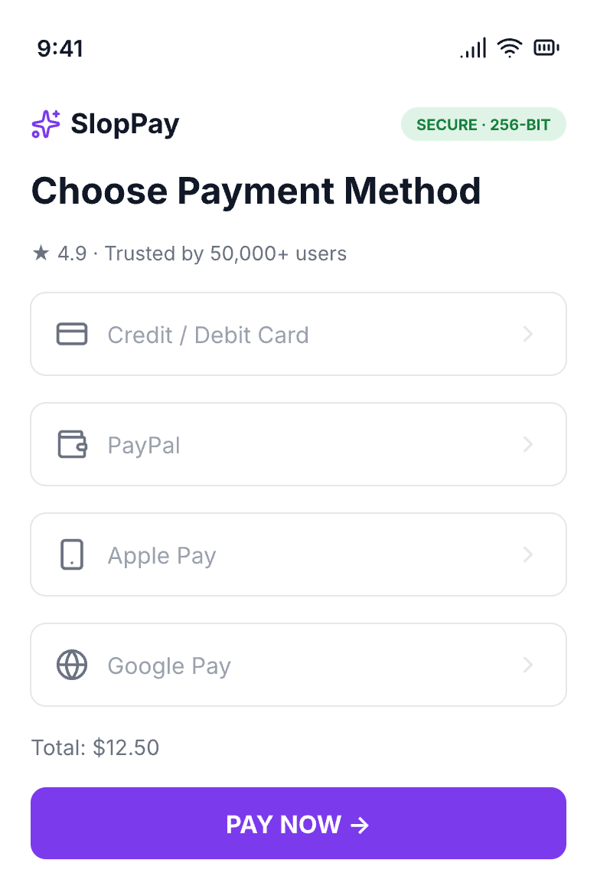</a> | <a href="assets/compare/ui/ui-after.png">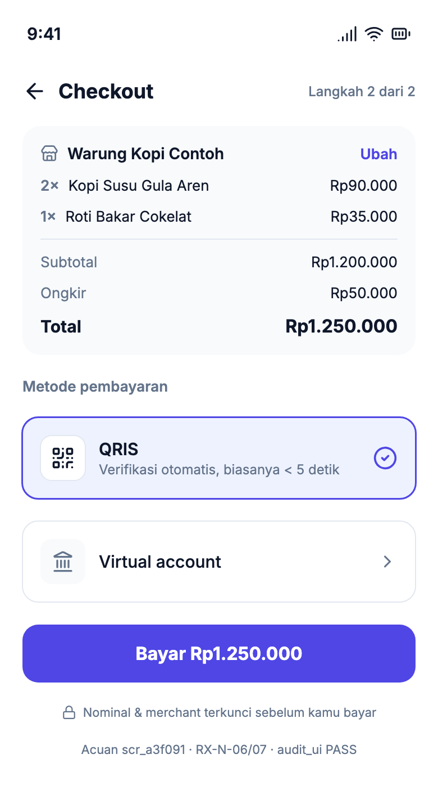</a> |
| Global template, made-up numbers, dollars, thin contrast. | 2–3 core colors + one accent (RX-C-07), consistent spacing (RX-C-08), Rupiah, `screen_id` evidence. |

**`ryux-copy` — Indonesian copywriting** · natural language, Rupiah, error messages

| Before — no ryux | After — `ryux-copy` |
|:--|:--|
| <a href="assets/compare/copy/copy-before.png">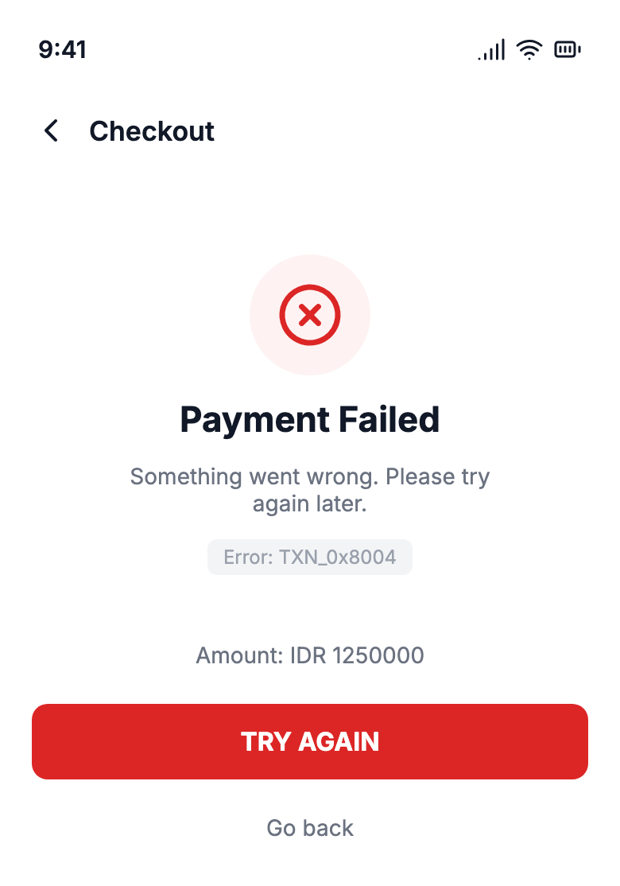</a> | <a href="assets/compare/copy/copy-after.png">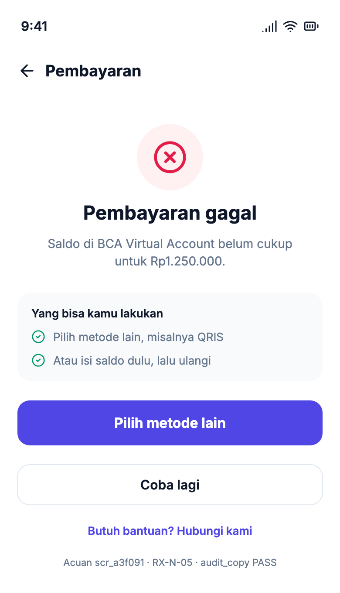</a> |
| "Payment Failed", vague message, technical error code, dollars, shouting button. | "Pembayaran gagal" with cause + fix (RX-N-05), natural Indonesian (RX-L-07), Rupiah (RX-L-06). |

**`ryux-a11y` — Accessibility** · contrast, text size, touch targets, focus

| Before — no ryux | After — `ryux-a11y` |
|:--|:--|
| <a href="assets/compare/a11y/a11y-before.png">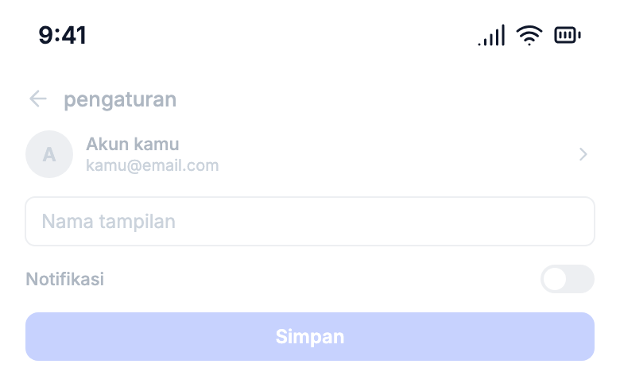</a> | <a href="assets/compare/a11y/a11y-after.png">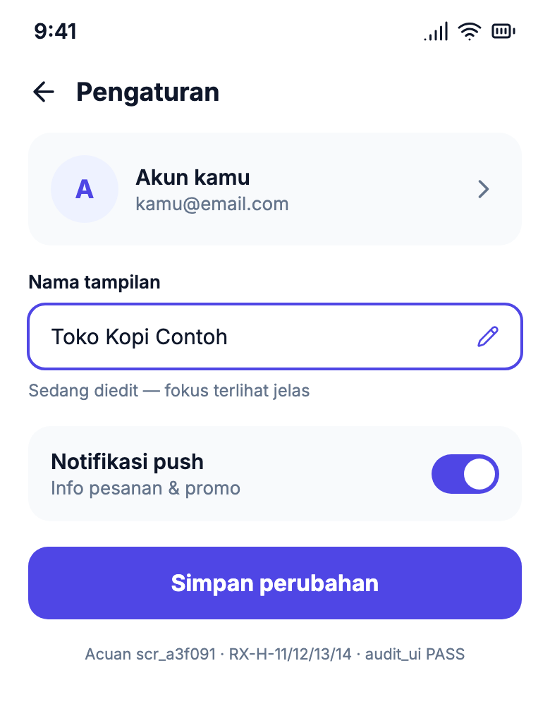</a> |
| 11px text at ~2:1 contrast, placeholder-only labels, small targets, washed-out button. | ≥16px text at AA contrast (RX-H-11), ≥48px targets (RX-H-12), visible focus (RX-H-13). |

**`ryux-ux` — Applied UX patterns (NNGroup)** · forms, validation, minimal fields, keypad

| Before — no ryux | After — `ryux-ux` |
|:--|:--|
| <a href="assets/compare/ux/ux-before.png">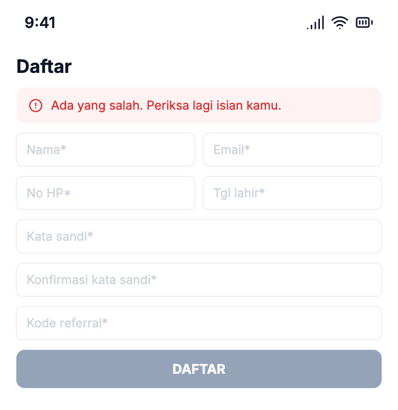</a> | <a href="assets/compare/ux/ux-after.png">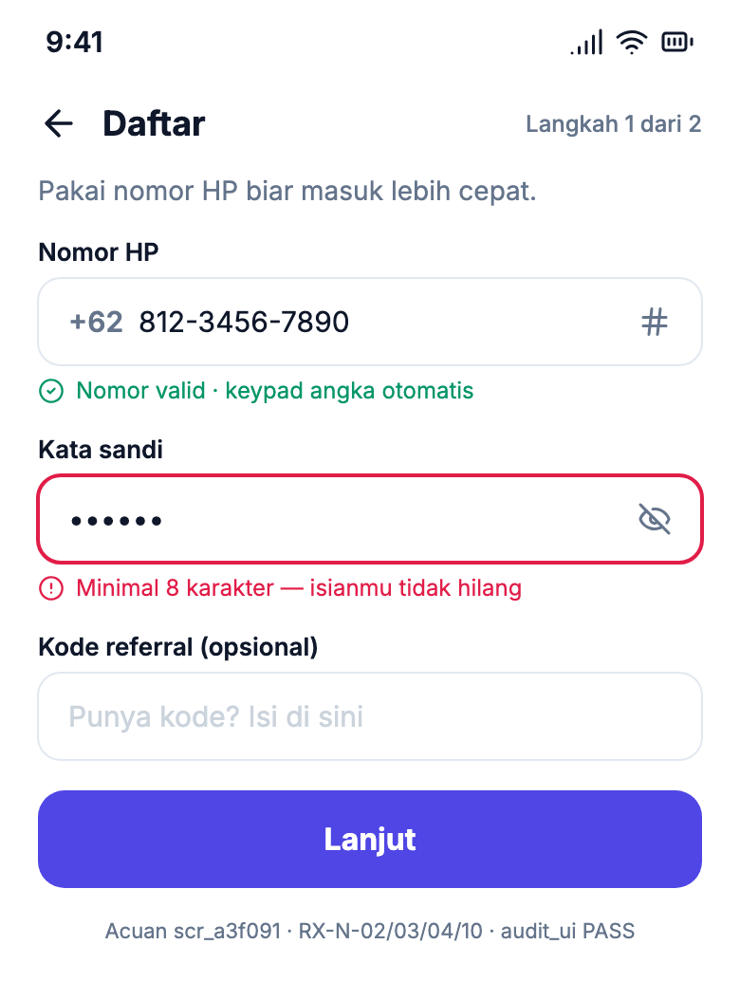</a> |
| Two columns, placeholder labels, everything required, vague error. | Single column with labels above (RX-N-02), inline validation that keeps input (RX-N-03), minimal fields (RX-N-04), numeric keypad (RX-N-10). |

**`ryux-local` — Indonesian patterns** · QRIS, virtual account, fees, Rupiah

| Before — no ryux | After — `ryux-local` |
|:--|:--|
| <a href="assets/compare/local/local-before.png">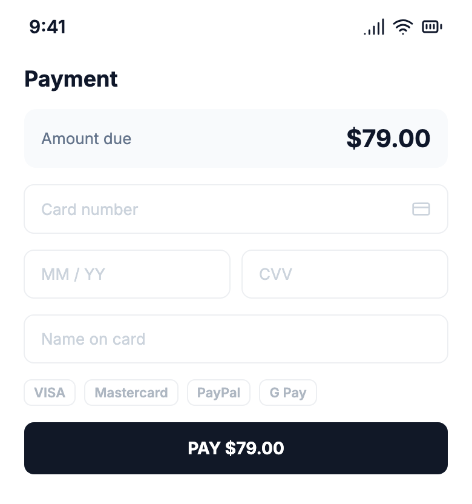</a> | <a href="assets/compare/local/local-after.png">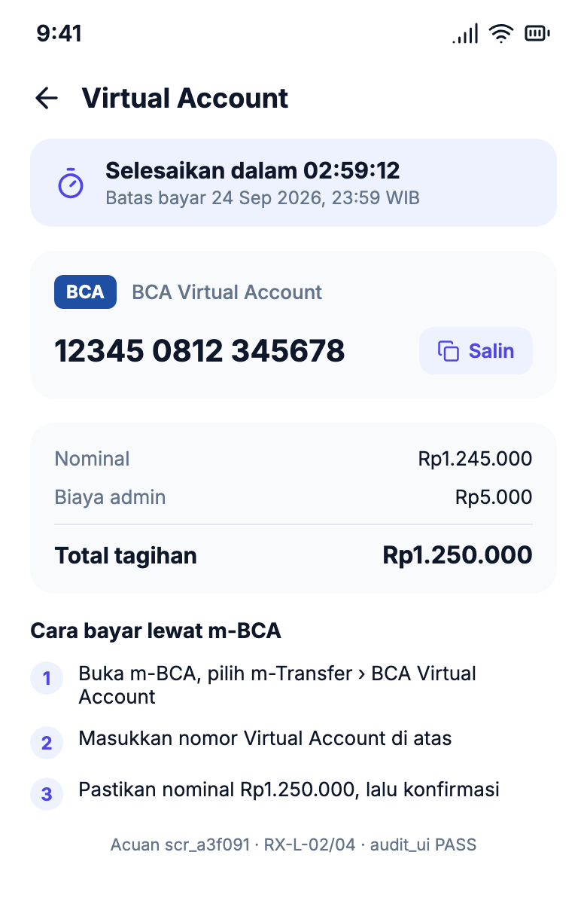</a> |
| Global card form, dollars, foreign methods, no local pattern. | Virtual Account + copy button + payment deadline (RX-L-02), transparent admin fee (RX-L-04), Rupiah. |

**Bonus — usability review over MCP** (`heuristic_eval`; an audit tool, not an install concern)

| Before — shallow critique | After — `heuristic_eval` |
|:--|:--|
| <a href="assets/compare/review/review-before.png">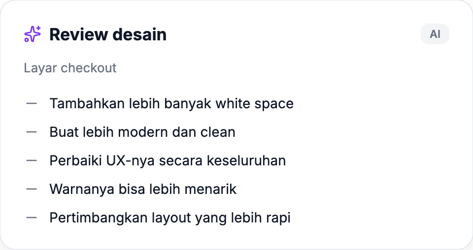</a> | <a href="assets/compare/review/review-after.png">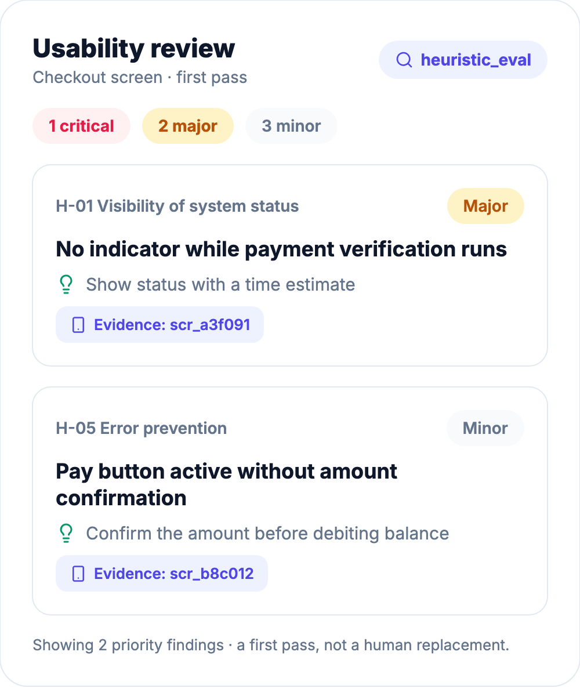</a> |
| Opinions without evidence. | Structured findings: heuristic, severity 0–4, recommendation, `screen_id` evidence. |

**Landing page — hero section** · headline, CTA, social proof

_No ryux_ — a generic "AI-flavored" hero: buzzwords, invented stats, fake logos.

<a href="assets/compare/hero/hero-before.png">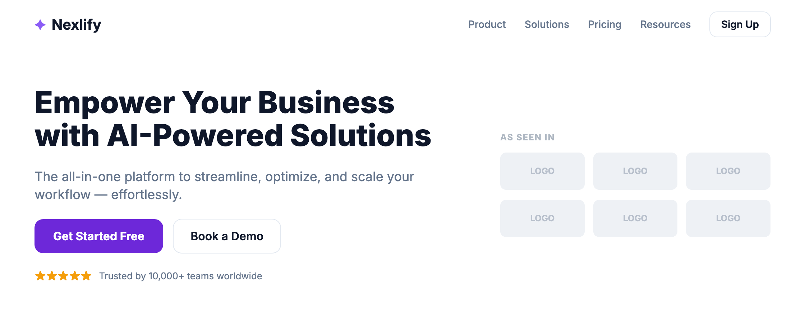</a>

_With `ryux-rules`_ — specific, honest, Indonesian, a meaningful brand color (green = profit), one clear CTA, local patterns (WhatsApp login, transfer to BCA).

<a href="assets/compare/hero/hero-after.png">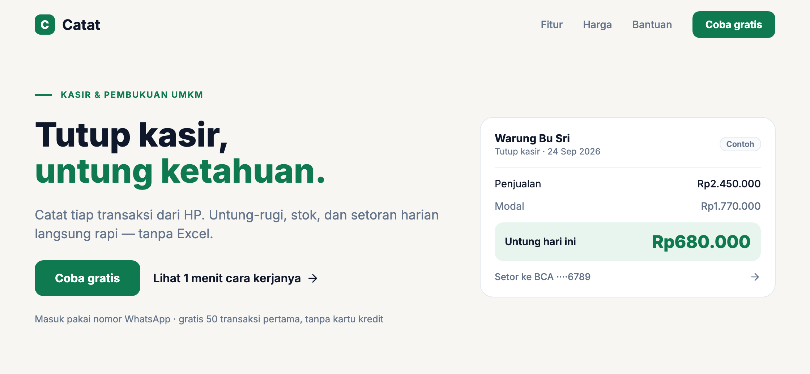</a>

Slop: meaningless buzzwords (RX-C-06), "10,000+" with no source (RX-C-03), fake logos (RX-C-04), default-template indigo. ryux: a specific benefit in local idiom, a meaningful brand color, a real offer instead of invented stats, local patterns (WhatsApp/BCA), and a preview marked `Contoh` (RX-C-05).

**Design decisions**

| Before | After |
| --- | --- |
| "Put QRIS at the top because it looks good." | "Put QRIS at the top — the pattern Indonesian F&B apps use for small amounts (`scr_demo_001`)." |

`RX-C-01` rejects any decision without `screen_id` evidence; `delivery_gate` enforces it.

The UI checks run by `audit_ui` / `heuristic_eval`: touch targets ≥ 44px (RX-H-12), contrast ≥ 4.5:1
(RX-H-11), and complete states — loading/empty/error (RX-H-14). The screens above are built
honestly, not faked mockups (RX-C-05).

## Repo layout (pnpm monorepo)

```
apps/mcp/         MCP server (Cloudflare Workers) — 9 tools
packages/core/    @ryux/core — data + tool logic, platform-agnostic
packages/cli/     ryux-rules — CLI that installs the rules into AI agents
docs/             taxonomy.md, design-rules.md
```

Roadmap (not built yet): `apps/web` (Next.js site) and `packages/pipeline` (video capture → data).

## Quick start

Requires Node 20+ and pnpm.

```bash
pnpm install
pnpm dev:mcp        # MCP server at http://localhost:8787/mcp
pnpm typecheck
```

The MCP endpoint uses **Streamable HTTP** transport — connect through an MCP client (Claude Code,
MCP Inspector), not a regular browser.

### Install ryux-rules into your agent

```bash
npx ryux-rules            # wizard: pick your agent + concerns (ui, copy, a11y, ux, local)
```

Install only what you need — each concern becomes its own skill (e.g. `ryux-ui`, `ryux-copy`); the
core (evidence + honesty) always comes along. Details: [`packages/cli`](./packages/cli). Rule
source: [`docs/design-rules.md`](./docs/design-rules.md).

## Docs

| Document | Contents |
| --- | --- |
| [`docs/taxonomy.md`](./docs/taxonomy.md) | Controlled vocabulary: categories, flows, patterns, components |
| [`docs/design-rules.md`](./docs/design-rules.md) | The ryux design ruleset (RX-C / RX-H / RX-N / RX-L) |
| [`apps/mcp/README.md`](./apps/mcp/README.md) | Running and trying the MCP server |

## Status

**v0.1 (early access, free).** Data is still sample data, there's no login yet, and quota lives in
memory. Toward production: Supabase (`published` data, RLS on), OAuth, ledger-based quota, and
full-text + pgvector search.

## Security

See [`SECURITY.md`](./SECURITY.md) for how to report a vulnerability. Principles already in place:
OCR text is treated as data (never as instructions), RLS is on from the first migration, and no
secrets live in the repo.

## License

**Source-available**, © 2026 ryux.design (see [`LICENSE`](./LICENSE)). Free to use and modify for
your own work, but you may **not resell it or re-release it as a competing product**. Not a
derivative of, and not affiliated with, any third-party project.
