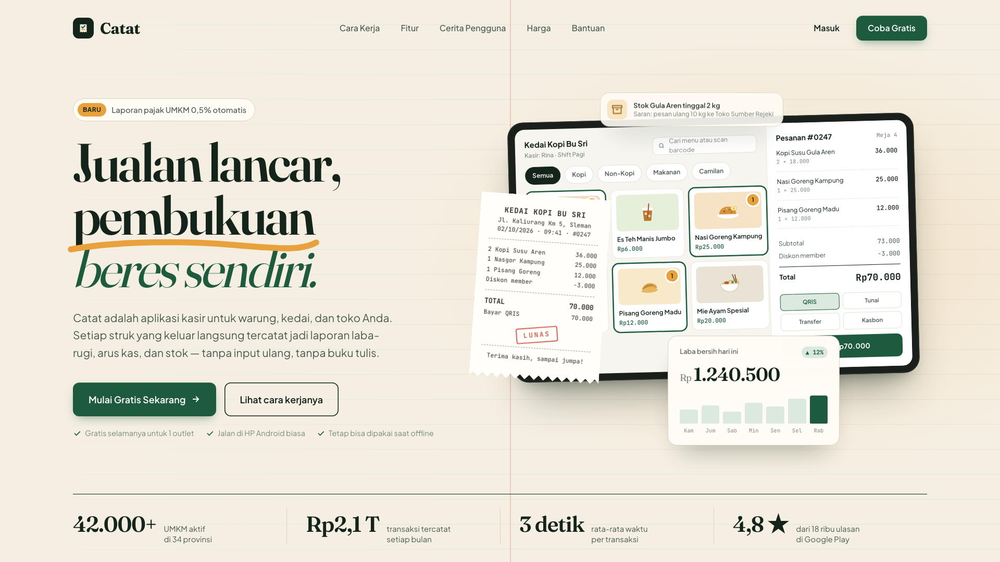
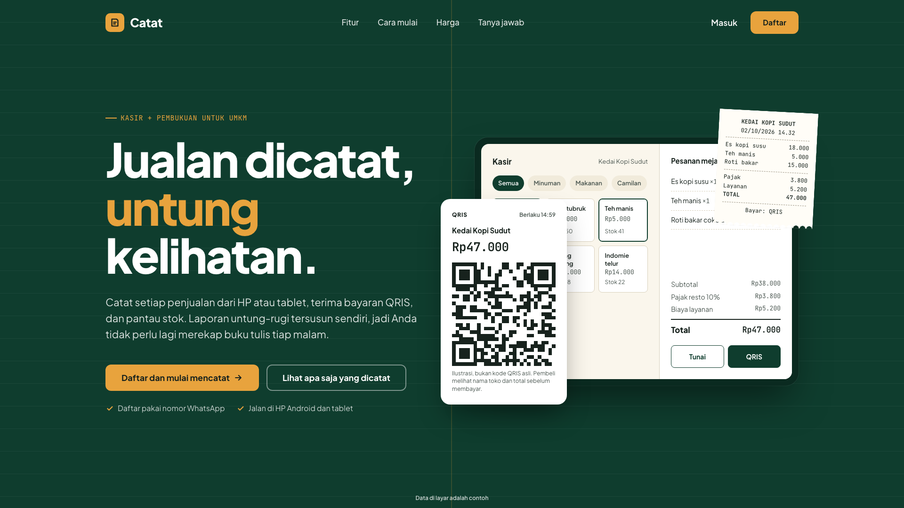
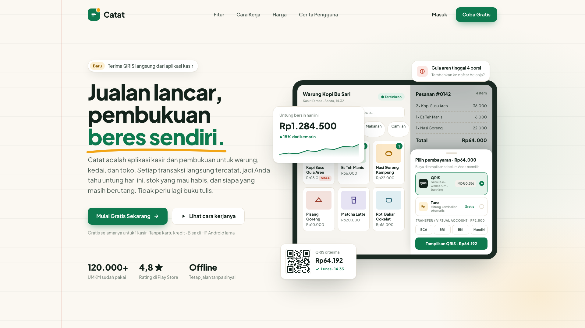
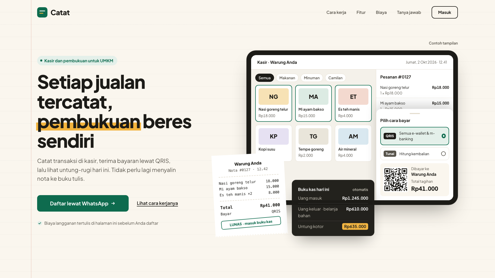
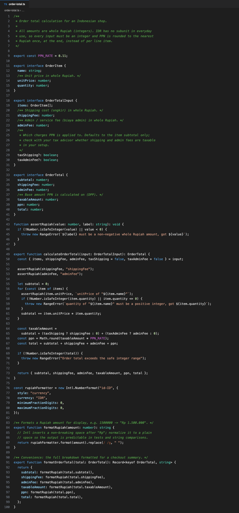
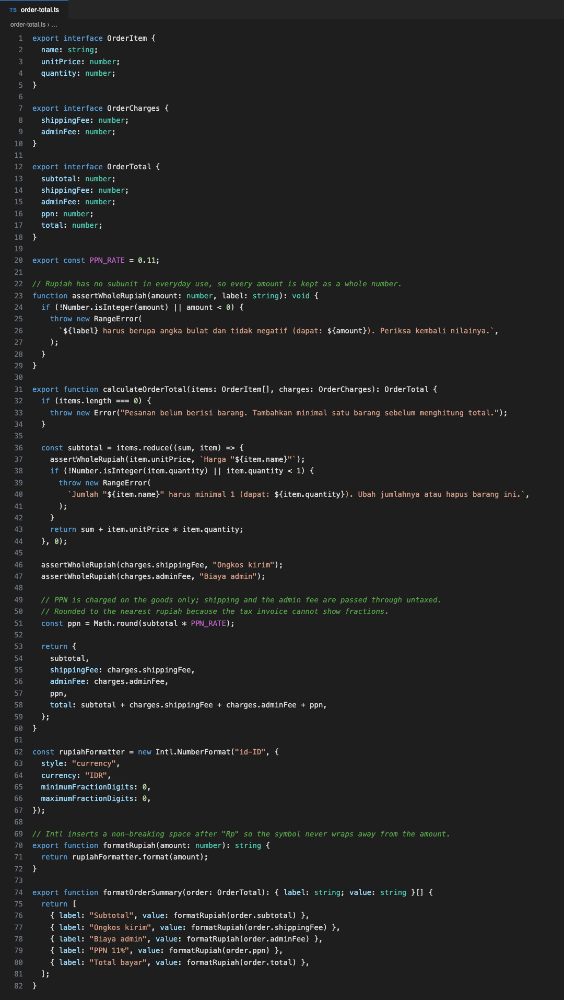
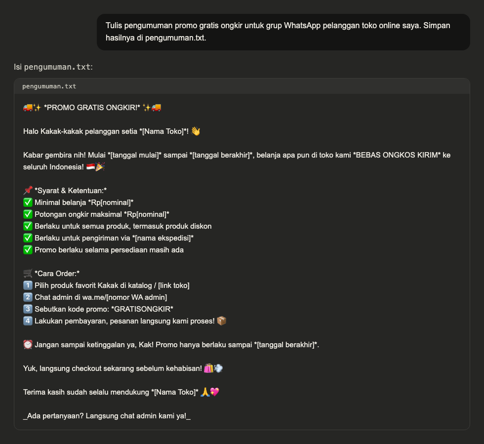
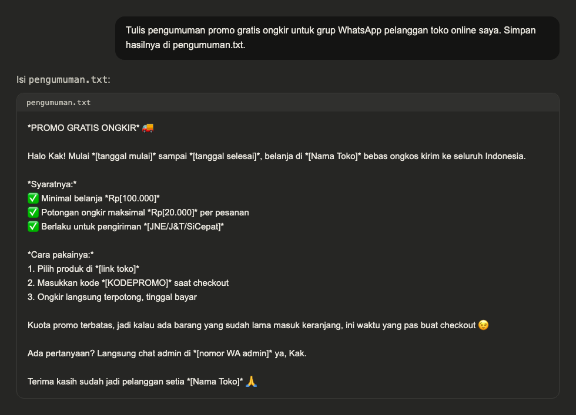

<p align="center">
  <a href="LICENSE"></a>
  
  
  
</p>

# ryux

> UI and flow references from real Indonesian apps, served to AI agents over MCP, with an anti-slop
> gate built in (**ryux-rules**). It's evidence-based: every design decision has to cite a real
> screen instead of a generic pattern.

> **New here?** Start with [GUIDE.md](./GUIDE.md). It walks you through it from scratch: install the
> rules into your agent, then connect it to the reference data.

## What makes it different

- **Evidence-based.** Every result carries a `screen_id`, app name, version, and capture date. A design decision has to point at a real screen, and `delivery_gate` enforces that.
- **Indonesia-first.** QRIS, virtual accounts, WhatsApp OTP, paylater, e-KYC, Rupiah formatting. These are the patterns global libraries skip.
- **Human judgment.** Designer notes (why a flow works, where it falls short) are written by people, not generated. That's the part that matters most.
- **Its own ruleset.** `ryux-rules` (RX-C / RX-H / RX-N / RX-L) is original work, MIT-licensed, with no third-party dependencies.

## What's inside

- **Nine MCP tools** in three groups: research (`search_screens`, `get_flow`, `get_local_pattern`, `compare_apps`, `extract_design_direction`), audit (`audit_ui`, `audit_copy`, `heuristic_eval`, `delivery_gate`), and a design bridge.
- **ryux-rules** is 45 rules across four layers: an anti-slop filter (RX-C), usability and accessibility heuristics (RX-H), applied UX patterns from NNGroup research (RX-N), and Indonesian patterns and copy (RX-L). There's a PASS/FAIL Delivery Gate before you ship.
- **The `ryux-rules` CLI** installs the rules into Claude Code, Cursor, or AGENTS.md in one command. You pick only the concerns you need (ui, copy, a11y, ux, local, code), the way you'd pick skills. You can browse every skill in [`skills/`](./skills).

## See the difference

The UI, Code, and Copy examples are real agent output. Each brief ran headless (`claude -p`) in a clean folder, and
only the setup changed between runs. Nothing was edited by hand. `ryux-rules` filters what shouldn't
be there. ryux reference data gives direction. They do different jobs, and the UI matrix shows both.

### UI

One brief, run four ways: *"a 1920×1080 landing page for Catat, a cashier and bookkeeping app for
Indonesian UMKM."*

| **Tanpa apa-apa** | **`ryux-rules` saja** | **Referensi ryux saja** |
|:--|:--|:--|
| <a href="assets/compare/ui/without.png"></a> | <a href="assets/compare/ui/rules.png"></a> | <a href="assets/compare/ui/reference.png"></a> |
| Polished, and that is the trap. "42.000+ UMKM", "Rp2,1 T", and "4,8 dari 18 ribu ulasan" have no source (RX-C-03). | Honest. The invented numbers are gone, and the mockup is labeled as an example (RX-C-05). Direction is the agent's own guess. | Direction from real Indonesian screens: fees shown before you pick a method (RX-N-06, RX-L-04). The invented "120.000+" stays, because data directs and does not filter. |

Only the fourth is honest and directed at the same time:

| **`ryux-rules` + referensi ryux** |
|:--|
| <a href="assets/compare/ui/both.png"></a> |
| No invented numbers, every total adds up, and the mockup is marked `Contoh tampilan` (RX-C-03, RX-C-05). Direction comes from real screens: sign up through WhatsApp, and a QRIS sheet that names the shop and the amount before you pay (RX-L-01). |

### Code

One brief, run twice: *"a TypeScript module that calculates an order total with shipping, an admin
fee, and PPN 11%, and formats it as Rupiah."* The "after" run had `ryux-code` and `ryux-copy` installed.

| Before | After |
|:--|:--|
| <a href="assets/compare/code/before.png"></a> | <a href="assets/compare/code/after.png"></a> |
| Doc comments that repeat the field name, English errors a shop owner can't act on. | Comments only say why (RX-K-01). Errors name the fix in Indonesian (RX-K-06, RX-N-05). Labels ready for the UI (RX-L-07). |

### Copy

One prompt, run twice: *"Tulis pengumuman promo gratis ongkir untuk grup WhatsApp pelanggan toko
online saya."* The "after" run had `ryux-copy` and `ryux-local` installed.

| Before | After |
|:--|:--|
| <a href="assets/compare/chat/before.png"></a> | <a href="assets/compare/chat/after.png"></a> |
| Emoji on every line, "selama persediaan masih ada" plus "sebelum kehabisan" with nothing behind it. | Shorter and plainer, placeholders in Rupiah format (RX-L-06). The agent flagged "Kuota promo terbatas" as a line to delete unless the quota is real (RX-N-09). |

Every image opens full size if you click it.

<details>
<summary><strong>Per-concern gallery</strong> (a11y, ux, local, review, error copy, and ryux's own landing)</summary>

**`ryux-copy`** · Indonesian copywriting · natural language, Rupiah, error messages

| Before (no ryux) | After (`ryux-copy`) |
|:--|:--|
| <a href="assets/compare/copy/copy-before.png"></a> | <a href="assets/compare/copy/copy-after.png"></a> |
| "Payment Failed", a vague message, a technical error code, dollars, a shouting button. | "Pembayaran gagal" with the cause and the fix (RX-N-05), natural Indonesian (RX-L-07), Rupiah (RX-L-06). |

**`ryux-a11y`** · accessibility · contrast, text size, touch targets, focus

| Before (no ryux) | After (`ryux-a11y`) |
|:--|:--|
| <a href="assets/compare/a11y/a11y-before.png"></a> | <a href="assets/compare/a11y/a11y-after.png"></a> |
| 11px text at roughly 2:1 contrast, placeholder-only labels, small targets, a washed-out button. | 16px or larger at AA contrast (RX-H-11), targets of 48px and up (RX-H-12), visible focus (RX-H-13). |

**`ryux-ux`** · applied UX patterns (NNGroup) · forms, validation, fewer fields, keypad

| Before (no ryux) | After (`ryux-ux`) |
|:--|:--|
| <a href="assets/compare/ux/ux-before.png"></a> | <a href="assets/compare/ux/ux-after.png"></a> |
| Two columns, placeholder labels, everything required, a vague error. | One column with labels above the fields (RX-N-02), inline validation that keeps what you typed (RX-N-03), fewer fields (RX-N-04), a numeric keypad (RX-N-10). |

**`ryux-local`** · Indonesian patterns · QRIS, virtual account, fees, Rupiah

| Before (no ryux) | After (`ryux-local`) |
|:--|:--|
| <a href="assets/compare/local/local-before.png"></a> | <a href="assets/compare/local/local-after.png"></a> |
| A global card form, dollars, foreign methods, no local pattern. | A Virtual Account with a copy button and a payment deadline (RX-L-02), a transparent admin fee (RX-L-04), and Rupiah. |

**Bonus: usability review over MCP** (`heuristic_eval`, an audit tool rather than an install concern)

| Before (shallow critique) | After (`heuristic_eval`) |
|:--|:--|
| <a href="assets/compare/review/review-before.png"></a> | <a href="assets/compare/review/review-after.png"></a> |
| Opinions, no evidence. | Structured findings: the heuristic, a severity from 0 to 4, a recommendation, and `screen_id` evidence. |

**ryux's own landing page (we use ryux on ryux)** · the honest test

_Without ryux._ The same product pitched like generic AI slop: a buzzword headline, a "10,000+" with no source, and a fake "AS SEEN IN" logo wall.

<a href="assets/compare/landing/landing-before.png"></a>

_With `ryux-rules`._ Designed in pen.dev under its own rules: an editorial layout, one accent, a specific evidence-first headline, and a real `search_screens` result (screen_id, app, version, capture date, designer note) where the slop version put fake logos.

<a href="assets/compare/landing/landing-after.png"></a>

Real evidence (`scr_a3f091`, app, version, date) in place of a fake logo wall (RX-C-04): the "after" shows the product's whole point instead of borrowing credibility. Specific over buzzword (RX-C-06), one accent over default-everything (RX-C-07), an honest early-access line over an invented "10,000+" (RX-C-03).

**Design decisions**

| Before | After |
| --- | --- |
| "Put QRIS at the top because it looks good." | "Put QRIS at the top, since that's what Indonesian F&B apps do for small amounts (`scr_demo_001`)." |

`RX-C-01` rejects any decision that has no `screen_id` behind it, and `delivery_gate` enforces that.

The UI checks that `audit_ui` and `heuristic_eval` run: touch targets of 44px or more (RX-H-12),
contrast of at least 4.5:1 (RX-H-11), and the full set of states, loading, empty, and error
(RX-H-14). The screens above are built honestly. They're not faked mockups (RX-C-05).

</details>

## Repo layout (pnpm monorepo)

```
apps/mcp/         MCP server (Cloudflare Workers), 9 tools
apps/web/         ryux.design site (Next.js), landing + waitlist
packages/core/    @ryux/core, shared data and tool logic
packages/cli/     ryux-rules, the CLI that installs the rules into agents
skills/           browsable copies of each ryux-rules skill
docs/             taxonomy.md, design-rules.md
```

Still to come: `packages/pipeline`, which turns captured video into data.

## Quick start

You'll need Node 20+ and pnpm.

```bash
pnpm install
pnpm dev:mcp        # MCP server on http://localhost:8787/mcp
pnpm dev:web        # ryux.design site on http://localhost:3000
pnpm typecheck
```

The MCP endpoint speaks **Streamable HTTP**, so connect through an MCP client (Claude Code, MCP
Inspector) rather than a regular browser.

### Install ryux-rules into your agent

```bash
npx ryux-rules            # wizard: pick your agent and concerns (ui, copy, a11y, ux, local, code)
```

Install only what you need. Each concern becomes its own skill (`ryux-ui`, `ryux-copy`, and so on),
and the core (evidence and honesty) always comes along. There's more detail in
[`packages/cli`](./packages/cli), and the rules themselves live in
[`docs/design-rules.md`](./docs/design-rules.md).

## Docs

| Document | What's in it |
| --- | --- |
| [`docs/taxonomy.md`](./docs/taxonomy.md) | Controlled vocabulary: categories, flows, patterns, components |
| [`docs/design-rules.md`](./docs/design-rules.md) | The ryux design ruleset (RX-C / RX-H / RX-N / RX-L) |
| [`apps/mcp/README.md`](./apps/mcp/README.md) | Running and trying the MCP server |

## Status

**v0.1, early access, free.** The data is still sample data, there's no login yet, and quota lives
in memory. On the way to production: Supabase (`published` data with RLS on), OAuth, ledger-based
quota, and full-text plus pgvector search.

## Security

See [`SECURITY.md`](./SECURITY.md) for how to report a vulnerability. A few things we already do:
OCR text is treated as data and never as instructions, RLS is on from the first migration, and no
secrets live in the repo.

## License

**MIT**, © 2026 ryux.design (see [`LICENSE`](./LICENSE)). Use it, change it, ship it. The code and the
ryux-rules ruleset are covered by this license. The reference data (screens, flows, designer notes)
and the hosted service are separate and not part of this repo.
