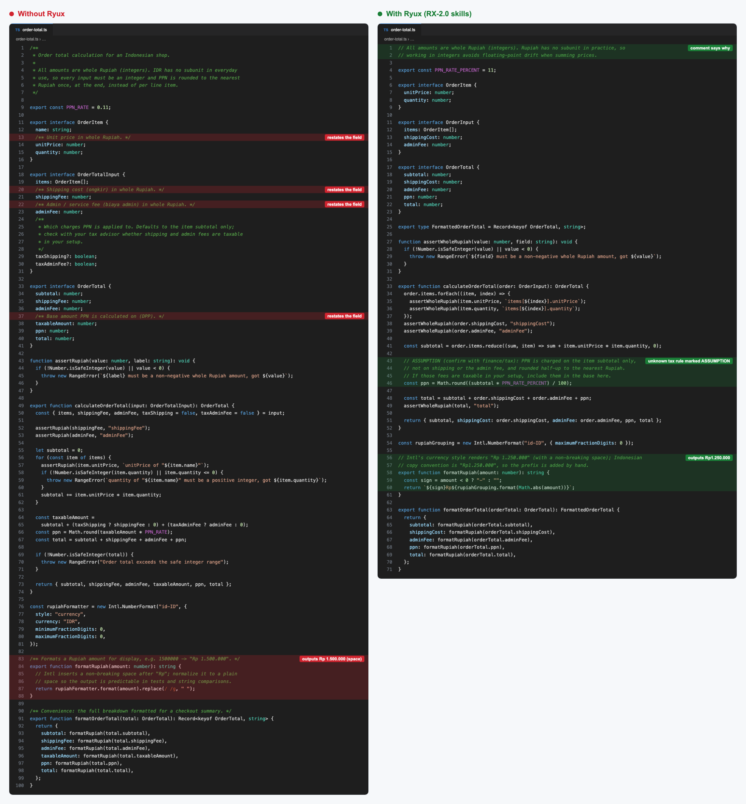

<p align="center">
  <a href="LICENSE"></a>
  
  
  
</p>

# RYUX: design intelligence

> **RYUX is a design intelligence layer for AI agents and designers.** It helps them analyze, build,
> critique, and verify interfaces with design reasoning and evidence, instead of generic output.
>
> Not an AI UI generator. Not an anti-slop framework. Not a design system.

> **New here?** Start with [GUIDE.md](./GUIDE.md). It walks you through installing the skills into
> your agent and connecting it to the reference data.

## How RYUX works

Every task follows the same four steps.

1. **Choose the capability.** Analyze, Build, Critique, or QA, depending on the job.
2. **Load only what the task needs.** A payment flow loads product, interaction, forms, content,
   and edge cases. A copy edit loads content and anti-slop.
3. **Decide with evidence.** For a consequential choice, compare two or three patterns, choose by
   context, and rate the evidence as Strong, Thin, or None. With no evidence, RYUX says so and shows
   the options instead of inventing a reference.
4. **Pass the gates.** Hard Gates block the failures that are never acceptable. The Delivery Gate
   reports PASS, FAIL, or N/A for ten areas, and RYUX claims only what was actually checked.

```
  ANALYZE          BUILD           CRITIQUE           QA
  understand       create          evaluate           verify
       \              |                |              /
        +-------------+----------------+-------------+
                              |
        DESIGN REASONING   product, UX, interaction, forms, content, UI,
                           design system, accessibility, responsive,
                           frontend, edge cases
                              |
        QUALITY GATES      anti-slop, Hard Gates, Delivery Gate
                              |
        RYUX KNOWLEDGE     real product screens and designer notes
```

| Capability | Question it answers | Skill |
| --- | --- | --- |
| **Analyze** | What is actually in this interface? | `ryux-analyze` |
| **Build** | How do we make this without generic AI output? | `ryux-core` plus the knowledge skills |
| **Critique** | Does this interface make sense, and what should change first? | `ryux-critique` |
| **QA** | Did the build match the intended design, at every width and state? | `ryux-visual-qa` |

The 16 skills have four roles, so RYUX is a way of working rather than a pile of rules.

| Role | Skills | Job |
| --- | --- | --- |
| **Core** | `ryux-core` | Picks the capability and the skills, then runs the decision protocol and the gates |
| **Knowledge** | product, ux, interaction, forms, edge-cases, content, ui, design-system, accessibility, responsive, frontend | Reasoning for one area. Each rule says when it applies, when it does not, and what it costs |
| **Capability** | `ryux-analyze`, `ryux-critique` | Workflows that combine the knowledge skills |
| **Gate** | `ryux-visual-qa`, `ryux-anti-slop` | Verify the build and filter generic output |

The skills work on their own. The RYUX MCP server adds evidence from RYUX Knowledge
(`search_screens`, `heuristic_eval`, `delivery_gate`). Figma, pen.dev, and browser tools let RYUX
see the real design.

## What makes it different

- **Evidence over taste.** Every result carries a `screen_id`, app name, version, and capture date. A design decision points at a real screen, or it is marked as a judgment call.
- **Honest about what it knows.** RYUX rates its evidence and reports what it did not check. It never claims "pixel perfect" or "fully accessible" without proof.
- **Human judgment.** Designer notes explain why a flow works and where it falls short. People write them, not AI, and they are the most valuable part of the library.
- **Local depth where global libraries are thin.** The first market covered is Indonesia: QRIS, virtual accounts, WhatsApp OTP, paylater, and e-KYC.
- **Its own ruleset.** RYUX (RX-2.0) is original work, MIT-licensed, with no third-party rule dependencies.

## What's inside

- **Nine MCP tools** in three groups: research (`search_screens`, `get_flow`, `get_local_pattern`, `compare_apps`, `extract_design_direction`), audit (`audit_ui`, `audit_copy`, `heuristic_eval`, `delivery_gate`), and a design bridge.
- **RYUX** is 16 skills: a small `ryux-core` (choose the capability, which skills to load, Hard Gates, a 10-area Delivery Gate, honest claims), 13 knowledge skills from product thinking to visual QA, and the capability skills `ryux-analyze` and `ryux-critique`. Each skill is a short framework plus rules marked [Required], [Preferred], or [Contextual], with Hard Gates, Purpose Gates instead of style bans, and Quality Locks.
- **One install for every agent.** `npx skills add`, the `npx @ryuxdsgn/ryux` CLI, or the Claude Code plugin put the skills into Claude Code, Codex, Cursor, Gemini CLI, OpenCode, Cline, Copilot, and more. Agents load only the skills a task needs. Browse every skill in [`skills/`](./skills).

## See the difference

Each brief below ran headless (`claude -p`) in an empty folder, once without RYUX and once with the
RYUX skills installed by the CLI (`npx @ryuxdsgn/ryux`): 1.4 for UI, 1.3 for Code and Copy. The agent chose which skills to load.
Neither run had the RYUX MCP, so no reference screens were used. The screenshots are the agents' real
output, not edited by hand. The colored boxes are annotations added afterwards.

### UI

*"Design only the hero section of a landing page, 1440 wide by 900 tall, for RYUX: a design
intelligence layer for AI coding agents and designers. It installs as skills into Claude Code,
Cursor, Codex, and other agents (npx @ryuxdsgn/ryux), and an MCP server gives agents reference
screens from real apps as evidence."* Both runs designed in pen.dev through its MCP.

<a href="assets/compare/ui/compare.png"></a>

Both heroes look finished, and that is the trap. Without RYUX, the agent invents a GitHub star
count and a tool RYUX does not have, adds a "matched in 1,280 apps" stat, and puts real app names
on drawn screens so they read as evidence (RX-AS-01, RX-AS-07, RX-PR-02).

With RYUX, the demo session uses the real `search_screens` tool and is labeled as illustrative
(RX-UI-07). Its sample Delivery Gate fails a missing state instead of claiming everything passes.
The install command is the one primary action (RX-PR-03), and the wordmark is RYUX as given. Two
earlier runs had written it as "ryux", copying an older frame in the file, so RX-CD-05 now says to
follow the brief's spelling of brand names, and this run did.

### Code

*"Write a TypeScript module, order-total.ts, that calculates an order total with shipping, a service
fee, and sales tax, and formats it as currency for the user's locale."*

<a href="assets/compare/code/compare.png"></a>

Both versions use integer cents and Intl formatting. The difference is what they decide on their
own. Without RYUX, the module adds pricing rules nobody asked for and quietly decides that shipping
and fees are never taxed (RX-AS-06, RX-PR-02). With RYUX, it builds only the named charges and makes
taxability a required input, because it differs by jurisdiction. It also left out Rupiah formatting,
since no market was named, and offered to add it (RX-PR-05).

### Copy

*"Our product is Tally, an invoicing app for freelancers. Write an in-app announcement and a short
email telling existing customers about a new feature: scheduled invoices."*

<a href="assets/compare/chat/compare.png"></a>

Both read well. Without RYUX, the copy describes a product nobody specified: a time picker, a
delivery notification, an arrow menu next to Send, and a Scheduled tab (RX-PR-02, RX-AS-07). With
RYUX, unknown labels and links stay placeholders (RX-AS-03), and the open question about plans is
flagged for the team.

Earlier examples, including the Indonesian-market set (QRIS, Rupiah, WhatsApp), are in
[`docs/showcase.md`](docs/showcase.md#indonesian-market-examples).

## RYUX Analyze

> **Understand an existing interface before you change it.**

Point it at the same sources as Critique. It captures the design read-only and inventories layout,
grid, type scale, spacing, color roles, components and their states, hierarchy, navigation,
interaction patterns, content and tone, local patterns, and design language. Every item is
labeled **Measured** (read from Figma variables, CSS, or pen.dev properties), **Observed** (seen in
a capture), or **Inferred**, so a guess is never passed off as a fact. It does not judge; that is
Critique. The report is structured, not an essay: Context, Layout, Typography, Visual,
Components, Interaction, Design Language, Patterns Detected, Evidence, and Open questions. It feeds
Critique and can draft a `DESIGN.md` that Build follows.

```text
Analyze this Figma file before we add a new screen: https://www.figma.com/design/<file>/<name>
Analyze https://example.com and draft a DESIGN.md from it
```

## RYUX Critique

> **Get a senior design critique before your users do.**

Point it at a **Figma link**, a **pen.dev** design, a **website URL**, or a **screenshot**. It
captures the real design first (read-only), runs a Design Read across nine dimensions (clarity,
hierarchy, coherence, density, confidence, efficiency, specificity, recoverability, accessibility),
then lists at most 12 findings with severity, the rule behind each one, a fix, and what to keep. It
also says what it could not test, such as hover states on a static frame. Critique runs Analyze
first, then evaluates by category with the knowledge skills. Each finding has an **ID**,
**severity**, **category**, **evidence**, **impact** (who and which task, how badly), a
**recommendation**, a **confidence** level, and its **source** (the RYUX rule, plus a reference
screen or standard), so an inferred problem is never presented as a seen one.

**Visual QA** is the other side: give it the intended design and the build, and it lists every
deviation (spacing, type, color, size, position, components, states) with a fix.

```text
Critique this Figma frame: https://www.figma.com/design/<file>/<name>?node-id=1-2
Review https://example.com at desktop and mobile width
Review the selected frame in pen.dev
```

| Source | How it is captured |
| --- | --- |
| Figma | Figma MCP (`get_screenshot`, `get_metadata`, `get_design_context`) |
| pen.dev | pen.dev MCP (`TakeScreenshot`, plus a check for clipped content) |
| Website | `npx playwright screenshot` at 1440 and 390 wide, or a browser tool |
| Screenshot | Read directly |

## Install

Three ways in, all installing the same skills, including RYUX Analyze and RYUX Critique.

**1. Any agent, via [skills.sh](https://skills.sh)**

```bash
npx skills add ryuxdsgn/design-intelligence
```

**2. The RYUX CLI** (picks folders per agent, keeps `CLAUDE.md` / `GEMINI.md` / `AGENTS.md` pointers
in sync, and handles update and remove)

```bash
npx @ryuxdsgn/ryux                                         # interactive
npx @ryuxdsgn/ryux install --agent all --for designer      # Analyze, Critique, QA
npx @ryuxdsgn/ryux install --agent all --for builder       # Build, QA, Critique
npx @ryuxdsgn/ryux install --agent claude,cursor,codex     # non-interactive
npx @ryuxdsgn/ryux install --agent all --groups critique   # RYUX Critique only, every agent
npx @ryuxdsgn/ryux install --agent claude --global         # into your home directory
npx @ryuxdsgn/ryux update
npx @ryuxdsgn/ryux remove
```

**3. Claude Code plugin**

```text
/plugin marketplace add ryuxdsgn/design-intelligence
/plugin install ryux@design-intelligence
```

| Agent | Project folder | `--agent` |
| --- | --- | --- |
| Claude Code | `.claude/skills/` | `claude` |
| Codex | `.codex/skills/` | `codex` |
| Cursor | `.cursor/skills/` | `cursor` |
| Gemini CLI | `.gemini/skills/` | `gemini` |
| OpenCode | `.opencode/skills/` | `opencode` |
| Cline | `.cline/skills/` | `cline` |
| GitHub Copilot, Amp, Kimi Code, Antigravity | `.agents/skills/` | `copilot`, `amp`, `kimi`, `antigravity` |
| Anything else | rules inline in `AGENTS.md` | `agents-md` |

Presets: `--for designer`, `--for builder`, or `--for all`. Groups for fine control: `foundation`,
`ux`, `ui`, `engineering`, `quality`, `analyze`, and `critique`. `ryux-core` always comes along. The reference data (RYUX Knowledge) will be a separate hosted MCP service at
`https://mcp.ryux.design/mcp`. It is not live yet; see Status below. Until then you can run the MCP server locally (`pnpm dev:mcp`).

## Repo layout (pnpm monorepo)

```
apps/mcp/         MCP server (Cloudflare Workers), 9 tools
apps/web/         ryux.design site (Next.js), landing + waitlist
packages/core/    @ryux/core, shared data and tool logic
packages/cli/     ryux, the CLI that installs the skills into agents (npx @ryuxdsgn/ryux)
skills/           the 16 RYUX skills (Analyze, Build, Critique, QA), one folder each
.claude-plugin/   Claude Code plugin and marketplace manifests
docs/             taxonomy.md, design-rules.md
```

Still to come: `packages/pipeline`, which turns captured video into data.

## Quick start

You'll need Node 20+ and pnpm.

```bash
pnpm install
pnpm dev:mcp        # MCP server on http://localhost:8787/mcp
pnpm dev:web        # ryux.design site on http://localhost:3000
pnpm typecheck
```

The MCP endpoint speaks **Streamable HTTP**, so connect through an MCP client (Claude Code, MCP
Inspector) rather than a regular browser.

To install RYUX into your own agent, see [Install](#install).

## Docs

| Document | What's in it |
| --- | --- |
| [`docs/taxonomy.md`](./docs/taxonomy.md) | Controlled vocabulary: categories, flows, patterns, components |
| [`docs/design-rules.md`](./docs/design-rules.md) | The RYUX skills and rules: levels, Hard Gates, Purpose Gates, Quality Locks, Delivery Gate |
| [`apps/mcp/README.md`](./apps/mcp/README.md) | Running and trying the MCP server |

## Status

**Rules 1.3, early access, free.** The skills and rules are ready to install today. RYUX Knowledge is
in pilot. The capture pipeline (`pnpm knowledge`) works: screenshot import, AI draft tags marked
`source: ai`, human review, and human-written designer notes before anything is published. The
library itself is still small. The hosted MCP at `mcp.ryux.design` is not live yet, so agents
without it get rules and standards but no `screen_id` evidence. RYUX says so instead of inventing a
reference. Still to come: OAuth, ledger-based quota, and full-text plus pgvector search.

## Security

See [`SECURITY.md`](./SECURITY.md) for how to report a vulnerability. A few things we already do:
OCR text is treated as data and never as instructions, RLS is on from the first migration, and no
secrets live in the repo.

## License

**MIT**, © 2026 ryux.design (see [`LICENSE`](./LICENSE)). Use it, change it, ship it. The code and the
RYUX skills and rules are covered by this license. The reference data (screens, flows, designer notes)
and the hosted service are separate and not part of this repo.
