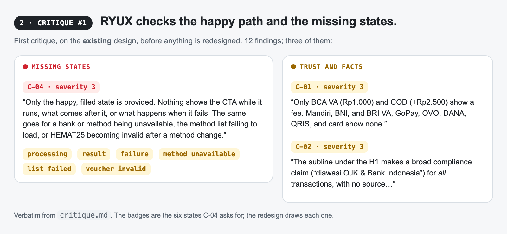
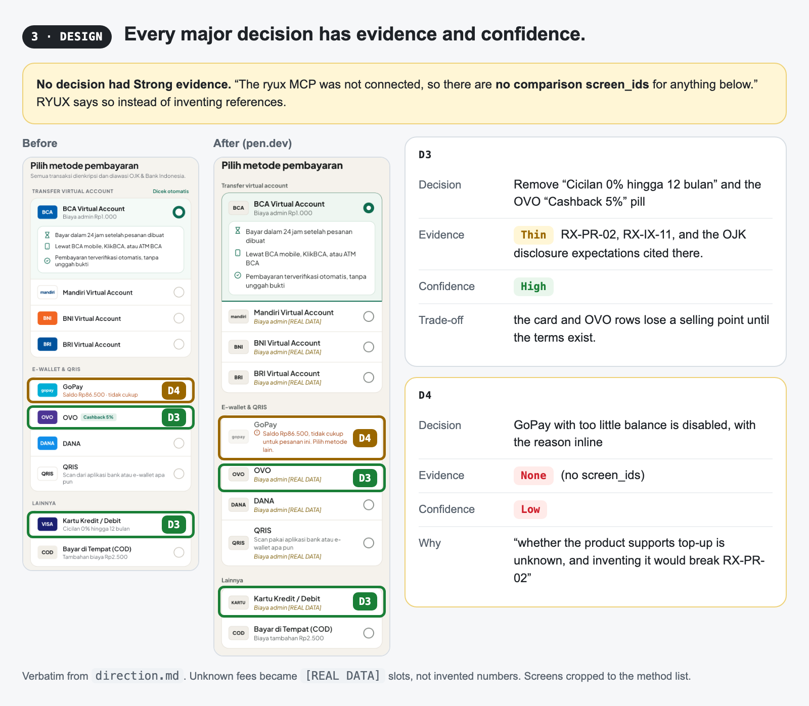
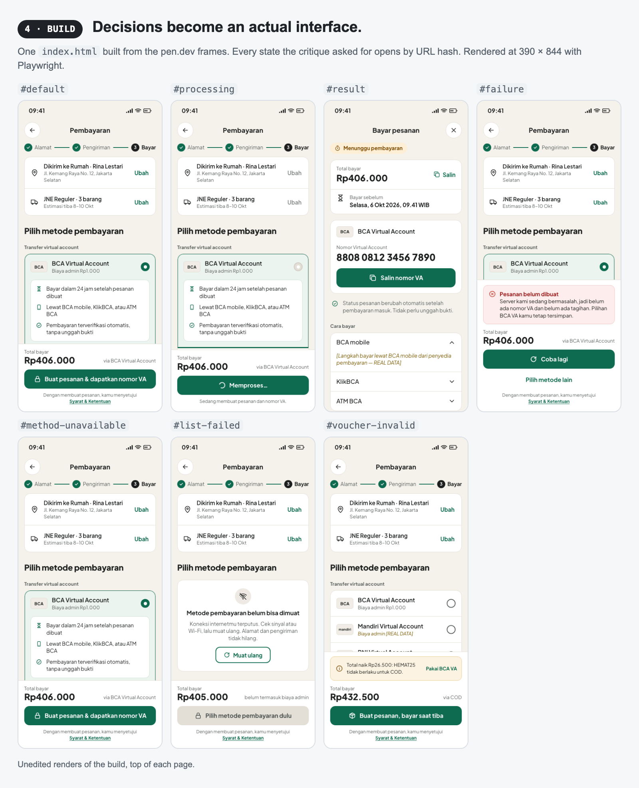
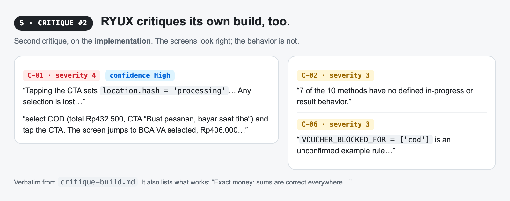
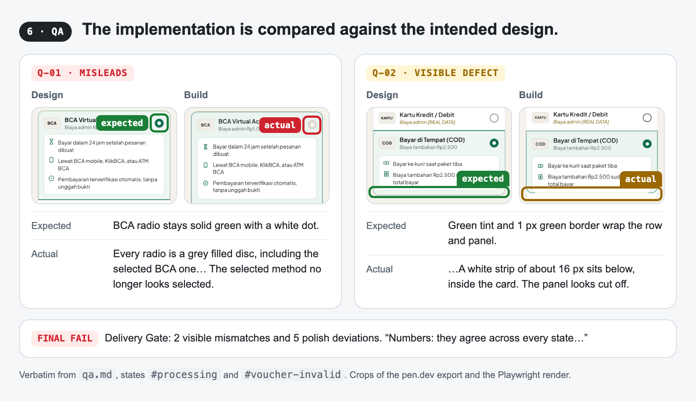

<p align="center">
  <a href="LICENSE"></a>
  
  
  
</p>

# RYUX: design intelligence

> **Understand before you design.**
>
> AI can generate an interface in seconds. RYUX makes it understand what it is building first.

RYUX helps AI agents and designers analyze, design, build, critique, and verify digital interfaces
using design knowledge and evidence.

**[Install](#install)** · **[The proof](#the-proof)** · **[How it works](#how-ryux-works)** · **[Showcase](docs/showcase.md)** · **[GitHub](https://github.com/ryuxdsgn/design-intelligence)**

## The proof

**Same prompt. Same agent. One has RYUX.**

*"Design a transaction detail page for a fintech app, shown after the user pays. Make it in pen.dev."*

Both agents asked questions first and got the same answers: an Indonesian wallet that pays merchants
by QRIS and bank transfer, three statuses (Berhasil, Diproses, Gagal), and three actions. Nothing
else was decided. Below is the median of three pairs, exported from pen.dev as the agents made it.

<a href="assets/compare/states/compare.png"></a>

Both designed the three statuses. The difference is what each did with what it did not know:

- **Without RYUX**, the pending screen says *"Biasanya selesai dalam beberapa menit"* and that the
  status will update by itself: a processing time and a behavior nobody gave it (RX-PR-02).
- **With RYUX**, the processing time, the failure reason, and the refund rule stay visible as
  `[REAL DATA: …]`. It also designed the states around the statuses: loading, a detail that failed
  to load (kept apart from a failed payment), and a narrow screen with long data (RX-EC-01).

| Pair | Screens, without / with | Unknowns marked, without / with | Invented rules, without / with |
| --- | --- | --- | --- |
| 1 | 1 / 4 | no / yes | 1\* / 0 |
| 2 | 1 / 6 | no / yes | 0 / 0 |
| 3 (above) | 3 / 6 | no / yes | 1 / 0 |

\* "Biasanya selesai dalam 1×24 jam", in the agent's notes for the pending screen.

> In 3 of 3 paired runs, RYUX designed the states beyond the happy path and marked what it did not
> know instead of inventing it. Without RYUX, the agent invented a business rule in 2 of 3.

How this was run: a fresh agent per run, same model, pen.dev, RYUX 2.3.3 as the only difference.
No RYUX MCP, so no reference screens: every decision in every run is evidence None. Counts are ours,
from the outputs. Three pairs is a small benchmark, not a study. Method and every run are in
[the showcase](docs/showcase.md#repeated-benchmark-ryux-233).

## What changed, and what did not

- **States.** RYUX designed more screens than the run without it in every pair; in two of three it
  added loading, failed to load, and a narrow width with long data.
- **Unknowns.** What the brief did not say stayed a visible placeholder instead of a confident sentence.
- **Decisions.** Every RYUX run wrote its design intent and a Decision Receipt per major decision; no run without RYUX did.
- **Not visual polish.** In a repeated blind test of a wallet home screen with illustration, ornament,
  and motion, RYUX did not score consistently better (3.71 vs 3.67 out of 5 across three pairs),
  and its restraint was never higher. RYUX changes the reasoning; it does not reliably make a screen prettier.

## More comparisons

Single runs, headless (`claude -p`) in an empty folder, once without RYUX and once with it, on
earlier RYUX releases. Neither run had the RYUX MCP. The colored boxes are annotations added
afterwards. A landing-page hero comparison from the same series is in
[the showcase](docs/showcase.md#landing-page-hero-single-run).

### Code

*"Write a TypeScript module, order-total.ts, that calculates an order total with shipping, a service
fee, and sales tax, and formats it as currency for the user's locale."*

<a href="assets/compare/code/compare.png"></a>

Both versions use integer cents and Intl formatting. The difference is what they decide on their
own. Without RYUX, the module adds pricing rules nobody asked for and quietly decides that shipping
and fees are never taxed (RX-AS-06, RX-PR-02). With RYUX, it builds only the named charges and makes
taxability a required input, because it differs by jurisdiction. It also left out Rupiah formatting,
since no market was named, and offered to add it (RX-PR-05).

### Copy

*"Our product is Tally, an invoicing app for freelancers. Write an in-app announcement and a short
email telling existing customers about a new feature: scheduled invoices."*

<a href="assets/compare/chat/compare.png"></a>

Both read well. Without RYUX, the copy describes a product nobody specified: a time picker, a
delivery notification, an arrow menu next to Send, and a Scheduled tab (RX-PR-02, RX-AS-07). With
RYUX, unknown labels and links stay placeholders (RX-AS-03), and the open question about plans is
flagged for the team.

Earlier examples, including the Indonesian-market set (QRIS, Rupiah, WhatsApp), are in
[`docs/showcase.md`](docs/showcase.md#indonesian-market-examples).

## How RYUX works

Give RYUX a screen. It separates what it sees from what it assumes and from what it doesn't know.
Then it makes design decisions, each with its evidence and confidence. Then it builds. Then it
checks whether the build matches the decision.

```
WITHOUT RYUX   "Use QRIS as the primary payment method because Indonesian users prefer it."

RYUX           Decision    Prioritize QRIS
               Evidence    3 observed checkout flows
               Confidence  Medium
               Why         QRIS appears as a primary payment option across the observed references
               Unknown     the actual business conversion priority
```

*An illustration of the Decision Receipt format, not a real run.* With no references, the same
receipt reads **Evidence None, Confidence Low**, and RYUX says so, as it did in the
[checkout run](#end-to-end-one-checkout-five-capabilities).

- **Analyze** an interface that exists: what it sees, what it infers, what it doesn't know.
- **Design** the decisions: UX, UI, visual, interaction, and responsive, each with a receipt.
- **Build** them in your stack, without inventing rules, data, or API behavior.
- **Critique** before shipping: prioritized findings with evidence, impact, and a fix.
- **QA** the build against the design: expected versus actual, at every width and state.

### Why RYUX

Most AI design tools start generating too early. RYUX starts by understanding the problem, the
interface, the context, and the evidence available.

RYUX is not another UI generator. It does not start with "make me a beautiful dashboard". It starts
with: what are we designing, why, and what evidence do we have? When there is none, it says so
instead of inventing a reference.

```
Without RYUX:  prompt → generate → generic UI → invented content → missing states
With RYUX:     context → analyze → evidence → reason → design → build → critique → QA
```

| Without RYUX | With RYUX |
| --- | --- |
| UI straight away | Analyze what exists first |
| Invented numbers, users, and features | Evidence: observed, inferred, or a cited pattern, and "None" when there is none |
| The category's default layout | Three directions compared, one chosen for a reason |
| A happy path only | Every state and width, rendered and checked |
| "Done" | A Delivery Gate that says what was not checked |

### What makes it different

- **Evidence over taste.** Every result carries a `screen_id`, app name, version, and capture date. A design decision points at a real screen, or it is marked as a judgment call.
- **Honest about what it knows.** RYUX rates its evidence and reports what it did not check. It never claims "pixel perfect" or "fully accessible" without proof.
- **Human judgment.** Designer notes explain why a flow works and where it falls short. People write them, not AI, and they are the most valuable part of the library.
- **Local depth where global libraries are thin.** The first market covered is Indonesia: QRIS, virtual accounts, WhatsApp OTP, paylater, and e-KYC.
- **Its own ruleset.** RYUX's rules (IDs start with `RX-`) are original work, MIT-licensed, with no third-party rule dependencies.

### End-to-end: one checkout, five capabilities

<details>
<summary>A real run through Analyze → Design → Build → Critique → QA, with what RYUX improved and what it flagged</summary>

The checkout is only the example: it shows how RYUX reasons about a real interface, from first look
to final check. Every card is a real agent run with RYUX installed. Quotes are verbatim, and "…"
marks a cut.

The run uses the five capabilities in order, Analyze → Design → Build → Critique → QA, with one
addition: Critique runs twice. First on the existing screen, to find what to fix, then on our own
build.












**RYUX improved**

- ✓ The six missing states Critique named are designed and built: processing, result, failure,
  method unavailable, list failed, voucher invalid
- ✓ Every payment method has a fee slot, with `[REAL DATA]` where the fee is unknown
- ✓ Unsourced claims are gone: the OJK and Bank Indonesia line, the 0% installments, the cashback
- ✓ The money adds up in every state: Rp406.000, Rp405.000, Rp432.500

**RYUX flagged**

- ⚠ Its own build: the pay button throws away the buyer's chosen method (C-01, severity 4)
- ⚠ The voucher rule for COD is an unconfirmed example, not a business rule
- ⚠ Unknown: whether GoPay top-up exists, and why the methods are in this order
- ⚠ No decision had Strong evidence, because the ryux MCP was not connected
- ⚠ Delivery Gate: FAIL until the build defects are fixed

> RYUX doesn't pretend to know. It shows what it knows, what it infers, and what remains unknown.

</details>

## Install

**Start here** (installs RYUX for your agent and adds a short project context to `DESIGN.md`, so
RYUX knows your product, audience, and market before it designs anything):

```bash
npx @ryuxdsgn/ryux init --agent claude
npx @ryuxdsgn/ryux check        # anything wrong? this says what, and the command that fixes it
```

Or pick one of three ways in. All install the same single skill.

**1. Any agent, via [skills.sh](https://skills.sh)**

```bash
npx skills add ryuxdsgn/design-intelligence
```

**2. The RYUX CLI** (picks folders per agent, keeps `CLAUDE.md` / `GEMINI.md` / `AGENTS.md` pointers
in sync, and handles update and remove)

```bash
npx @ryuxdsgn/ryux                                     # interactive
npx @ryuxdsgn/ryux init --agent claude                 # install + DESIGN.md project context
npx @ryuxdsgn/ryux check                               # verify files, version, references, context
npx @ryuxdsgn/ryux install --agent claude,cursor,codex # non-interactive
npx @ryuxdsgn/ryux install --agent all                 # every supported agent
npx @ryuxdsgn/ryux install --agent claude --global     # into your home directory
npx @ryuxdsgn/ryux update                              # also migrates RYUX 1.x installs
npx @ryuxdsgn/ryux remove
```

**3. Claude Code plugin**

```text
/plugin marketplace add ryuxdsgn/design-intelligence
/plugin install ryux@design-intelligence
```

| Agent | Project folder | `--agent` |
| --- | --- | --- |
| Claude Code | `.claude/skills/` | `claude` |
| Codex | `.codex/skills/` | `codex` |
| Cursor | `.cursor/skills/` | `cursor` |
| Gemini CLI | `.gemini/skills/` | `gemini` |
| OpenCode | `.opencode/skills/` | `opencode` |
| Cline | `.cline/skills/` | `cline` |
| GitHub Copilot, Amp, Kimi Code, Antigravity | `.agents/skills/` | `copilot`, `amp`, `kimi`, `antigravity` |
| Anything else | rules inline in `AGENTS.md` | `agents-md` |

Upgrading from RYUX 1.x: `update` replaces the 16 `ryux-*` folders with the single `ryux/` folder.
The reference data (RYUX Knowledge) will be a separate hosted MCP service at
`https://mcp.ryux.design/mcp`. It is not live yet; see Status below. Until then you can run the MCP server locally (`pnpm dev:mcp`).

## MCP: optional external evidence

The skill works on its own. The RYUX MCP server adds evidence from RYUX Knowledge
(`search_screens`, `compare_apps`, `get_local_pattern`, `heuristic_eval`, `delivery_gate`). The
hosted server at `mcp.ryux.design` is not live yet; until then, run it locally with `pnpm dev:mcp`.

```bash
claude mcp add --transport http ryux https://mcp.ryux.design/mcp
```

## Deep proof

Does RYUX reason, or does it just make a prettier UI? One hero section, a real run, every step
quoted.

1. **Analyze and Critique.** RYUX inventoried the hero, then reported 12 findings. The top three are
   severity 3: unsourced numbers, real app names on drawn screens presented as findings, and
   tertiary text at 3.98:1, below WCAG's 4.5:1.
2. **Design.** RYUX compared three directions and chose a "design receipt" as the signature.
3. **Build.** One HTML and CSS file from the pen.dev frame's exact values, responsive down to 390 wide.
4. **QA.** Rows 22px apart where the design says 27px, and three defects at 390, where no design
   existed. The Delivery Gate said FAIL and listed what it did not check.

<a href="assets/compare/demo/compare.png"></a>


**It missed something, and that became a rule.** The made-up tool name `find_references` survived
the first critique; RYUX's real tool is `search_screens`. A fact check was added to Critique, and a
rerun on the same screen listed `find_references` as its first finding, marked "contradicted".

```
miss → evidence → rule → rerun → caught
```

> RYUX improves through evidence, not confidence.

The full write-up, with method and history, is in [the showcase](docs/showcase.md#hero-case-study-the-full-run), including the QA renders.

## Under the hood

RYUX is modular inside, but you never manage its parts.

RYUX Knowledge, the design intelligence modules, and the quality gates are described in
[GUIDE.md](GUIDE.md#how-ryux-thinks).

<details>
<summary>How RYUX works, the skill layout, and the deeper capability guides</summary>

### The four steps

Every task follows the same four steps.

1. **Choose the capability.** Analyze, Design, Build, Critique, or QA, depending on the job.
2. **Read only what the task needs.** A payment flow reads product, interaction, forms, content,
   and edge cases. A copy edit reads content and anti-slop.
3. **Decide with evidence.** For a consequential choice, compare two or three patterns, choose by
   context, and rate the evidence as Strong, Thin, or None. With no evidence, RYUX says so and shows
   the options instead of inventing a reference.
4. **Pass the gates.** Hard Gates block the failures that are never acceptable. The Delivery Gate
   reports PASS, FAIL, or N/A for ten areas, and RYUX claims only what was actually checked.

### What's inside

Complexity inside, simplicity outside. The one skill holds a router, five capabilities, and twelve
knowledge modules:

```
ryux/
  SKILL.md          router: entry points, how RYUX works, levels, Hard Gates, task table, Delivery Gate
  capabilities/     analyze, design, build, critique, qa
  knowledge/        product, ux, interaction, forms, edge-cases, content, ui, design-system,
                    accessibility, responsive, frontend, anti-slop
```

- **Rules with levels**: every rule is [Required], [Preferred], or [Contextual], with Hard Gates, Purpose Gates instead of style bans, and Quality Locks. Browse them in [`skills/ryux/`](./skills/ryux) and [`docs/design-rules.md`](./docs/design-rules.md).
- **Nine MCP tools**: research (`search_screens`, `get_flow`, `get_local_pattern`, `compare_apps`, `extract_design_direction`) and audit (`audit_ui`, `audit_copy`, `heuristic_eval`, `delivery_gate`).
- **One install for every agent**: `npx skills add`, the `npx @ryuxdsgn/ryux` CLI, or the Claude Code plugin.

### RYUX Analyze

> **Understand an existing interface before you change it.**

Point it at the same sources as Critique. It captures the design read-only and inventories layout,
grid, type scale, spacing, color roles, components and their states, hierarchy, navigation,
interaction patterns, content and tone, local patterns, and design language. Every item is
labeled **Measured** (read from Figma variables, CSS, or pen.dev properties), **Observed** (seen in
a capture), or **Inferred**, so a guess is never passed off as a fact. It does not judge; that is
Critique. The report is structured, not an essay: Context, Layout, Typography, Visual,
Components, Interaction, Design Language, Patterns Detected, Evidence, and Open questions. It feeds
Critique and can draft a `DESIGN.md` that Build follows.

```text
Analyze this Figma file before we add a new screen: https://www.figma.com/design/<file>/<name>
Analyze https://example.com and draft a DESIGN.md from it
```

### RYUX Critique

> **Get a senior design critique before your users do.**

Point it at a **Figma link**, a **pen.dev** design, a **website URL**, or a **screenshot**. It
captures the real design first (read-only), runs a Design Read across nine dimensions (clarity,
hierarchy, coherence, density, confidence, efficiency, specificity, recoverability, accessibility),
then lists at most 12 findings with severity, the rule behind each one, a fix, and what to keep. It
also says what it could not test, such as hover states on a static frame. Critique runs Analyze
first, then evaluates by category with the knowledge modules. Each finding has an **ID**,
**severity**, **category**, **evidence**, **impact** (who and which task, how badly), a
**recommendation**, a **confidence** level, and its **source** (the RYUX rule, plus a reference
screen or standard), so an inferred problem is never presented as a seen one.

**Visual QA** is the other side: give it the intended design and the build, and it lists every
deviation (spacing, type, color, size, position, components, states) with a fix.

```text
Critique this Figma frame: https://www.figma.com/design/<file>/<name>?node-id=1-2
Review https://example.com at desktop and mobile width
Review the selected frame in pen.dev
```

| Source | How it is captured |
| --- | --- |
| Figma | Figma MCP (`get_screenshot`, `get_metadata`, `get_design_context`) |
| pen.dev | pen.dev MCP (`TakeScreenshot`, plus a check for clipped content) |
| Website | `npx playwright screenshot` at 1440 and 390 wide, or a browser tool |
| Screenshot | Read directly |

### Repo layout (pnpm monorepo)

```
apps/mcp/         MCP server (Cloudflare Workers), 9 tools
apps/web/         ryux.design site (Next.js), landing + waitlist
packages/core/    @ryux/core, shared data and tool logic
packages/cli/     ryux, the CLI that installs the skills into agents (npx @ryuxdsgn/ryux)
skills/ryux/      the one RYUX skill: router, 5 capabilities, 12 knowledge modules (generated from packages/cli/src)
.claude-plugin/   Claude Code plugin and marketplace manifests
docs/             taxonomy.md, design-rules.md
```

Still to come: `packages/pipeline`, which turns captured video into data.

### Quick start

You'll need Node 20+ and pnpm.

```bash
pnpm install
pnpm dev:mcp        # MCP server on http://localhost:8787/mcp
pnpm dev:web        # ryux.design site on http://localhost:3000
pnpm typecheck
```

The MCP endpoint speaks **Streamable HTTP**, so connect through an MCP client (Claude Code, MCP
Inspector) rather than a regular browser.

To install RYUX into your own agent, see [Install](#install).

### Docs

| Document | What's in it |
| --- | --- |
| [`docs/taxonomy.md`](./docs/taxonomy.md) | Controlled vocabulary: categories, flows, patterns, components |
| [`docs/design-rules.md`](./docs/design-rules.md) | The RYUX skills and rules: levels, Hard Gates, Purpose Gates, Quality Locks, Delivery Gate |
| [`apps/mcp/README.md`](./apps/mcp/README.md) | Running and trying the MCP server |

</details>

## Status

RYUX 2.3, early access, free.

| | What |
| --- | --- |
| **Available now** | one skill with Analyze, Design, Build, Critique, and QA, and 12 knowledge modules; anti-slop gates; the CLI (`npx @ryuxdsgn/ryux`); skills.sh; the Claude Code plugin; the MCP server, run locally (`pnpm dev:mcp`) |
| **Early access** | RYUX Knowledge pilot: the capture and review pipeline (`pnpm knowledge`), with screenshot and web capture, AI draft tags and observations that a person reviews, and human-written designer notes |
| **Coming soon** | the hosted MCP at `mcp.ryux.design`, Knowledge search (full text and pgvector), OAuth and quota, and shared team standards |

## Security

See [`SECURITY.md`](./SECURITY.md) for how to report a vulnerability. A few things we already do:
OCR text is treated as data and never as instructions, RLS is on from the first migration, and no
secrets live in the repo.

## Contributing

Issues and pull requests are welcome on
[GitHub](https://github.com/ryuxdsgn/design-intelligence). Rules and skills are generated from
`packages/cli/src`; run `pnpm sync:skills` after changing them.

## License

**MIT**, © 2026 ryux.design (see [`LICENSE`](./LICENSE)). Use it, change it, ship it. The code and the
RYUX skills and rules are covered by this license. The reference data (screens, flows, designer notes)
and the hosted service are separate and not part of this repo.
