# RYUX showcase: what it changes, and how we know

> New to RYUX? The [README](../README.md) is the short version. This page is the evidence: what we
> ran, what changed, what did not, and the raw outputs so you can check it yourself.

## 01 · RYUX in 60 seconds

**Same prompt. Same model. One variable changed: RYUX.** Each run used a fresh agent. The prompt, the
model, the answers to any question, and the environment were the same; the only difference was
whether the RYUX skill was installed.

**What changed** (transaction detail, three paired runs, [raw outputs](benchmarks/en-td-2.3.3/)):

- Across all three runs, the agent with RYUX asked three questions before designing. Without RYUX it
  asked none in all three.
- Across all three runs, RYUX left the currency open as `[CUR]`. Without RYUX it assumed dollars in
  all three.
- Without RYUX, a business rule nobody gave appeared on the screen in 2 of 3 runs, and features nobody
  asked for in 3 of 3. With RYUX, neither appeared in any run.
- Across all three runs, RYUX wrote decision receipts with a confidence level, and designed six
  screens (three statuses, loading, a load error, a narrow width) where the run without RYUX designed
  one.

**What did not change:** how good the screens look. In a repeated blind test of a wallet home screen,
the mean score moved from 3.67 to 3.71 out of 5, and one pair dropped by 1.25. We do not claim that
RYUX makes AI-generated interfaces visually better.

**What went wrong with RYUX, in the same runs:** every RYUX run stated an unconfirmed behavior on
screen (it flagged it as an assumption), every one offered examples from one specific market in its
questions, only one of three wrote a design intent section, and the reasoning was 3 to 5 times
longer.

**Don't judge the output first. Inspect how the decision was made.**

## 02 · See the difference

Same prompt, same model: *"Design a transaction detail page for a fintech app, shown after the user
pays. Make it in pen.dev."* Real output from both runs of pair 2, sample data.

<a href="../assets/compare/en-states/compare.png">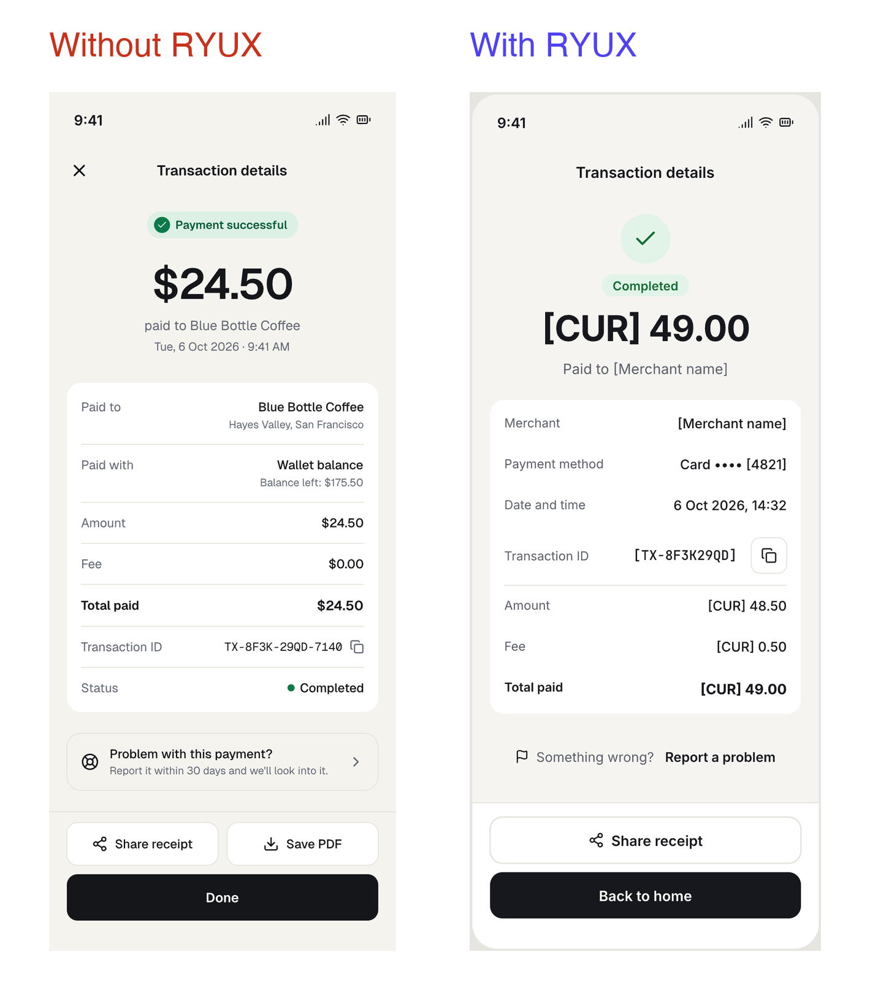</a>

Without RYUX, that one screen was the whole design. With RYUX, it was one of six:

<a href="benchmarks/en-td-2.3.3/b2/output.png">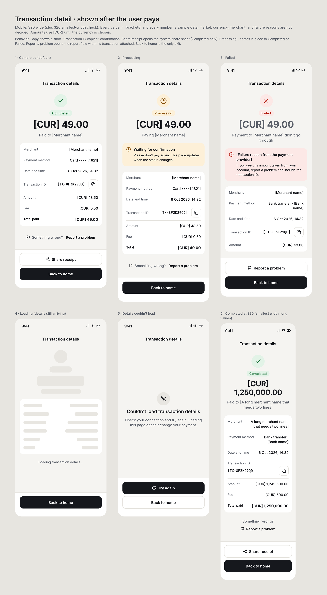</a>

**The difference isn't more UI. It's what the agent decided not to invent.**

Why it changed: the prompt and the model were the same.

- Without RYUX, the agent filled every gap itself: dollars, a 30-day reporting rule, a Save PDF
  button, and one happy-path screen.
- With RYUX, it asked three questions first, kept what nobody decided as `[CUR]` and `[CONFIRM]`,
  wrote down its decisions with a confidence level, and designed the states around the payment.

[View the raw runs →](benchmarks/en-td-2.3.3/)

## 03 · Current proof (RYUX 2.3.3, English, ryux MCP off)

Everything in this section was run on RYUX 2.3.3 in English, with the ryux MCP off. With the MCP off
there are no reference screens, so every decision in every run is rated evidence None. That isolates
RYUX's reasoning from its reference data.

### Case 01 · Transaction detail

| | |
| --- | --- |
| Experiment | EN-TD-2.3.3, 2026-10-06 |
| Prompt | "Design a transaction detail page for a fintech app, shown after the user pays. Make it in pen.dev." |
| Same in every run | prompt, model, fact sheet, pen.dev canvas |
| Changed | RYUX 2.3.3 installed in the B runs only |
| Runs | 3 pairs, a fresh agent each |
| Shown below | pair 2, picked by a rule set before the runs |
| Raw outputs | [every run: output, reasoning, questions](benchmarks/en-td-2.3.3/) |

**The claim is about uncertainty, not volume.** The RYUX runs designed more screens, but more screens
is a consequence, not the point: it can also mean overthinking. The point is what each run did with
the information it did not have.

What the run without RYUX stated as fact (A2, [reasoning](benchmarks/en-td-2.3.3/a2/reasoning.md)):

> USD and English copy. Sample data: $24.50 to Blue Bottle Coffee, no fee.
>
> It states the 30-day window so people know the rule up front.

What the run with RYUX kept open (B2, [reasoning](benchmarks/en-td-2.3.3/b2/reasoning.md)), from its
list of open questions:

> - Market, currency and locale formats.
> - Whether the fee is added to or included in the amount, and whether a fee applies to failed payments.
> - Whether Share receipt should exist for non-completed payments.

And one of its decisions, as written in the run:

```
Fee presentation
- Chosen: Amount + Fee = Total paid, shown in the card.
- Evidence: None. Confidence: Low.
- Assumption [CONFIRM]: the fee is charged on top of the amount. If the fee is
  taken out of the amount instead, the rows change.
- Failed state: shows only the attempted Amount, with no fee or total, because
  whether a fee applies to a failed payment is not decided.
```

The guess is still a guess, and it says so. B1 and B3 made the opposite call on the same question and
left the Total row out, because the rule was not given.

**What worked** (all three RYUX runs)

- ✓ Three questions asked before designing
- ✓ Currency left open as `[CUR]`
- ✓ No business rule or feature beyond what was given
- ✓ Decision receipts with a confidence level
- ✓ Six screens: Completed, Processing, Failed, loading, a load error, a narrow width

**What didn't**

- △ All three put "This page updates when the status changes" on the Processing screen. Each flagged
  it as an assumption, but the sentence still ships on the screen.
- △ B2 shows Total = amount + fee, a rule nobody gave. It is marked `[CONFIRM]`, but it is on screen.
- △ Only 1 of 3 wrote a section titled Design intent, although RYUX's Design capability asks for one.
- △ All three offered examples from one market (QRIS, virtual account, Rp) in questions about a
  generic prompt.
- △ The reasoning files were 3 to 5 times longer (84 to 158 lines, against 27 to 34).

**What we don't know**

- ? Whether this holds beyond pen.dev, with other models, or with more runs
- ? How much of the behavior comes from the model and how much from RYUX's text
- ? Whether any of it changes outcomes for real users

**Evidence status**

- Observed: every output, reasoning file and question list is [public](benchmarks/en-td-2.3.3/).
- Inferred: our reading that RYUX made uncertainty explicit.
- Not tested: visual quality, other models and tools, real users.

### What RYUX did not prove: visual quality

*"Design the home screen of a digital wallet app in pen.dev, mobile 390 wide …"* with the product
context in the prompt and a request to add illustration, UI ornament, and motion where they fit.
RYUX 2.3.3, three pairs, a fresh agent per run. The owner scored each pair blind (labels X and Y
drawn by script, the mapping opened after scoring), 1 to 5 on eight areas: context fit, originality,
restraint, visual hierarchy, consistency, production plausibility, AI-slop resistance, and
intentionality.

| Pair | Without RYUX | With RYUX | Difference |
| --- | --- | --- | --- |
| 1 | 3.25 | 4.00 | +0.75 |
| 2 | 4.38 | 3.13 | −1.25 |
| 3 | 3.38 | 4.00 | +0.63 |
| Mean | 3.67 | 3.71 | +0.04 |

**We do not use this benchmark to claim that RYUX makes AI-generated interfaces visually better.** No
area moved the same way in all three pairs, and restraint was never higher with RYUX. In pair 2,
RYUX's rule to commit to a point of view (three directions and a signature, RX-UI-12) produced a bold
"receipt" concept that scored 2 on context fit and on restraint. Both sides often reached the same
visual idea (the city, the commuter train, the morning sun). Motion was written as a specification,
so we compared motion reasoning, not motion quality.

**Evidence status**

- Observed: the scores above, given blind by one person.
- Inferred: that RYUX has no consistent effect on visual quality in this task.
- Not tested: other tasks, more scorers. The wallet runs' raw outputs are not published; they are not
  part of the English set.

### Case 02 · Two more prompts

The same setup on two new prompts, one pair each, with the protocol written and locked before the
first run. One run each, so read these as examples, not proof. [Raw outputs](benchmarks/en-cases-2.3.3/).

**Dashboard, first run.** *"Design the home dashboard of a project management web app, shown the
first time a new user logs in."*

| Without RYUX | With RYUX |
| --- | --- |
| <a href="benchmarks/en-cases-2.3.3/db-a1/output.png">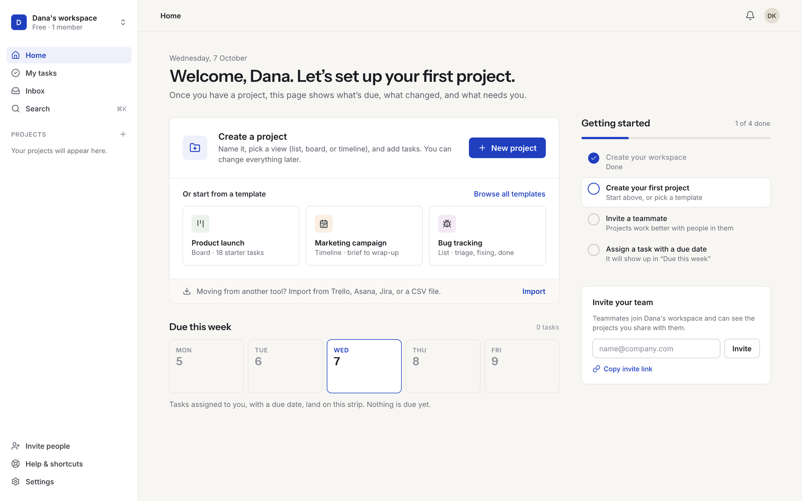</a> | <a href="benchmarks/en-cases-2.3.3/db-b1/output.png">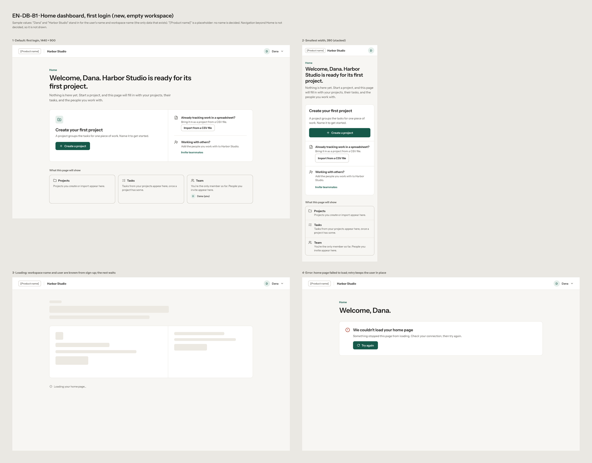</a> |
| 1 screen. Looks fuller and more finished. Invented: Trello, Asana, and Jira import, "18 starter tasks", "1 of 4 done", a Free plan. | 3 questions first, 4 screens, only the three given actions, `[Product name]` left open. Weakness: the outlined button's border is about 2:1, below the 3:1 controls need, and the page looks plain. |

**Orders list, mobile.** *"Design the orders list for an online store's admin app, on mobile."*

| Without RYUX | With RYUX |
| --- | --- |
| <a href="benchmarks/en-cases-2.3.3/or-a1/output.png">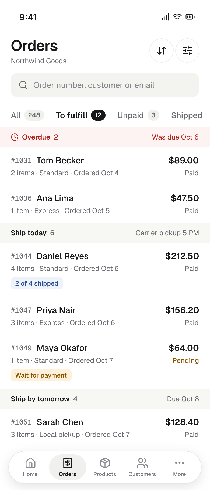</a> | <a href="benchmarks/en-cases-2.3.3/or-b1/output.png">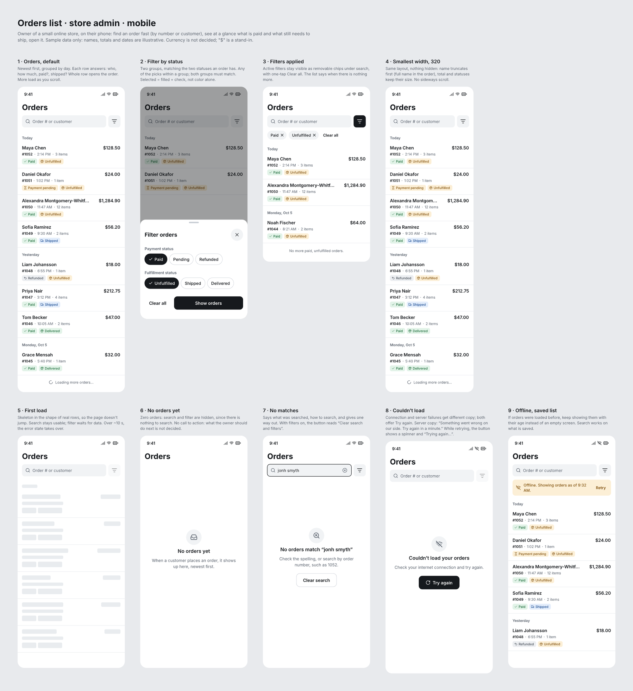</a> |
| 1 screen. Invented: a store name, order counts, ship-by deadlines, a 5 PM carrier pickup, a Returns tab. | 3 questions first, 9 screens, nothing beyond labeled sample data. Weakness: "$" stands in for the undecided currency, and its questions again offered examples from one market. |

**Evidence status**

- Observed: the outputs, reasoning files and question lists are [public](benchmarks/en-cases-2.3.3/).
- Inferred: the visible difference is fewer invented facts and more states, not polish.
- Not tested: anything beyond one pair per case.

## 04 · Designed with RYUX

Single screens from the runs above, shown large. These are real outputs, cropped from each run's
export and not retouched. They are here to show what RYUX can help produce, not to prove that it
works: that is the job of section 03.

<table>
<tr>
<td width="33%" valign="top"><a href="benchmarks/gallery/td-b2-processing.png">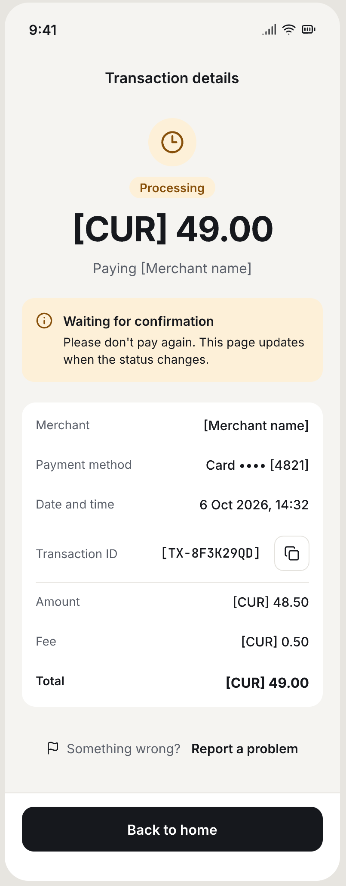</a><br><sub><b>Transaction detail · Processing</b><br>RYUX 2.3.3 · pen.dev · run <a href="benchmarks/en-td-2.3.3/b2/">b2</a><br>Showcase example, not benchmark evidence</sub></td>
<td width="33%" valign="top"><a href="benchmarks/gallery/td-b2-failed.png">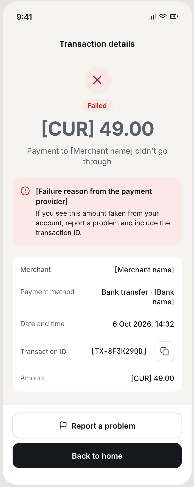</a><br><sub><b>Transaction detail · Failed</b><br>RYUX 2.3.3 · pen.dev · run <a href="benchmarks/en-td-2.3.3/b2/">b2</a><br>Showcase example, not benchmark evidence</sub></td>
<td width="33%" valign="top"><a href="benchmarks/gallery/or-b1-offline.png">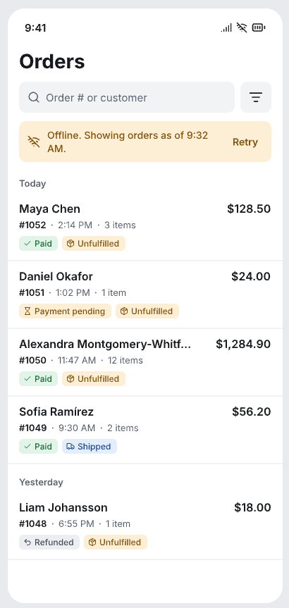</a><br><sub><b>Orders list · Offline</b><br>RYUX 2.3.3 · pen.dev · run <a href="benchmarks/en-cases-2.3.3/or-b1/">or-b1</a><br>Showcase example, not benchmark evidence</sub></td>
</tr>
<tr>
<td width="33%" valign="top"><a href="benchmarks/gallery/or-b1-filter.png">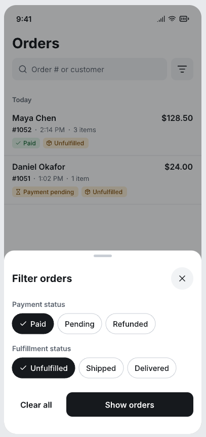</a><br><sub><b>Orders list · Filter</b><br>RYUX 2.3.3 · pen.dev · run <a href="benchmarks/en-cases-2.3.3/or-b1/">or-b1</a><br>Showcase example, not benchmark evidence</sub></td>
<td width="33%" valign="top"><a href="benchmarks/gallery/or-b1-no-matches.png">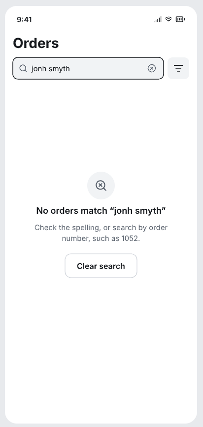</a><br><sub><b>Orders list · No matches</b><br>RYUX 2.3.3 · pen.dev · run <a href="benchmarks/en-cases-2.3.3/or-b1/">or-b1</a><br>Showcase example, not benchmark evidence</sub></td>
<td width="33%" valign="top"></td>
</tr>
</table>

<a href="benchmarks/gallery/db-b1-home.png">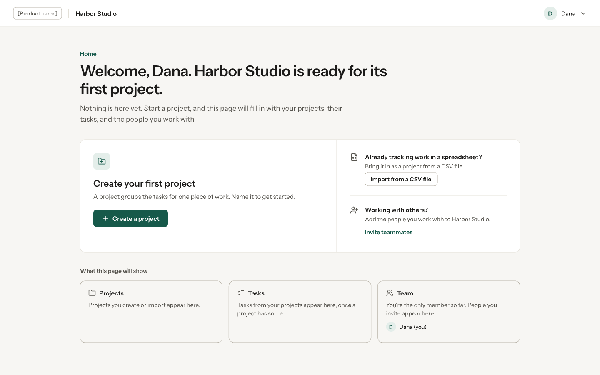</a>
<sub><b>First-run dashboard</b> · RYUX 2.3.3 · pen.dev · run <a href="benchmarks/en-cases-2.3.3/db-b1/">db-b1</a> · Showcase example, not benchmark evidence</sub>

## 05 · Mental model

```
             product context
                    │
                    ▼
                evidence
                    │
       ┌────────────┼────────────┐
       ▼            ▼            ▼
     known       inferred     unknown
       └────────────┼────────────┘
                    ▼
                decision
                    ▼
                 design
                    ▼
                  build
                    ▼
                   QA
```

A guess stays a guess. RYUX does not pretend to know: claims in its reports describe what was checked
and how, and words like "pixel perfect", "fully accessible", "production ready", "senior-level", or
"UX optimized" are not used without evidence. When there is no evidence, the decision says
Evidence: None.

## 06 · Reproduce it

1. Make two empty folders per pair, A and B. Copy RYUX (`skills/ryux/` from this repo) into
   `B/.claude/skills/ryux/`. Nothing goes into A.
2. Start a fresh agent per run with the same model, working only in its folder, told to ignore any
   other project's instructions. B is told to follow the installed skill; A uses no design skill.
3. Give both the identical prompt. If an agent asks questions, answer only from the fact sheet, the
   same for both sides. An agent that asks nothing gets nothing.
4. Each run adds one new frame to the shared pen.dev canvas, exports a PNG, and writes its reasoning.
   Run them one after another.
5. Decide before looking which pair you will show and how you will break ties. Count from the outputs,
   and publish every run, not only the pair you show.

The prompts, fact sheets, and counts for each experiment are in its README in
[`docs/benchmarks/`](benchmarks/).

## 07 · Limitations

- **Small samples.** Three pairs for transaction detail and wallet home, one pair per case in Case 02.
- **Counted by us.** The counts come from the outputs and were made by the operator. The wallet scores
  come from one person scoring blind.
- **The model is not separated out.** We compare with and without RYUX on one model. We do not know
  how much is the model and how much is RYUX's text.
- **Evidence None everywhere.** The ryux MCP was off, so these runs say nothing about reasoning with
  reference screens.
- **One tool.** Every run designed in pen.dev.
- **A known bias.** RYUX's questions offered examples from one market in 4 of 5 English runs. We think
  RYUX's own knowledge text causes it (its examples come from the first market it covers), but that
  is not tested yet.

## 08 · Historical: not the current benchmark

These examples are preserved for context. They are not part of the current 2.3.3 proof set and should
not be used as evidence for current claims. Several were made with earlier releases (RYUX 1.x and
2.0), several used the ryux MCP for reference screens, and the method changed over time. Each section
says which release and method it used.

### The first transaction-detail run (Indonesian, RYUX 2.3.3)

*Release and method: RYUX 2.3.3, ryux MCP off, an Indonesian fact sheet. Replaced as the current proof
by the English rerun in section 03.*

It was run to answer one question honestly: does RYUX change what an AI agent designs, and does that hold when the run is
repeated? Same prompt per task, a fresh agent per run, the same model, pen.dev, and RYUX 2.3.3 as
the only difference. No RYUX MCP, so no reference screens: every decision is evidence None. Three
pairs per task. Counts and scores are ours; this is a small benchmark, not a study.

#### Transaction detail (Indonesian fact sheet)

*"Design a transaction detail page for a fintech app, shown after the user pays. Make it in
pen.dev."* Questions were answered from one fixed fact sheet: an Indonesian wallet (QRIS and bank
transfer), statuses Berhasil, Diproses, Gagal, data fields, three actions; everything else "not
decided".

| Measure | P1 without | P1 with | P2 without | P2 with | P3 without | P3 with |
| --- | --- | --- | --- | --- | --- | --- |
| Questions asked | 6 | 3 | 4 | 3 | 5 | 3 |
| Screens designed | 1 | 4 | 1 | 6 | 3 | 6 |
| Unknowns marked on canvas | no | yes | no | yes | no | yes |
| Invented business rules | 1 (notes) | 0 | 0 | 0 | 2 (on canvas) | 0 |
| Design intent written | no | yes | no | yes | no | yes |
| Decision Receipts | none | yes | none | yes | none | yes |

Consistent in 3 of 3 pairs: more screens, unknowns marked, no invented rules, intent and receipts,
at most three questions. Pair 3 was the one in the README at the time: the median pair, chosen before looking at
the images, and the strongest run without RYUX (it also designed all three statuses).

#### What we learned then

- **RYUX helped:** states beyond the happy path, unknowns kept visible instead of invented, and
  decisions written down, in every transaction-detail pair.
- **RYUX did not help:** visual quality. Both conditions often reached the same visual idea (the
  city, the commuter train, the morning sun).
- **RYUX introduced problems:** a push toward a strong point of view can beat context and
  restraint, and RYUX runs always produce more screens and longer reasoning, which risks
  over-analysis on small tasks.

### Landing-page hero (single run, RYUX 2.0)

Moved from the README. A single run on an earlier release; the repeated wallet-home benchmark above
found no consistent visual difference, so read this as one example, not a pattern.

*"Design only the hero section of a landing page, 1440 wide by 900 tall, for RYUX: a design
intelligence layer for AI coding agents and designers. It installs as skills into Claude Code,
Cursor, Codex, and other agents (npx @ryuxdsgn/ryux), and an MCP server gives agents reference
screens from real apps as evidence. The hero should feature a custom illustration; create it with
pen.dev's Generate function."* Both runs designed in pen.dev and generated their illustration with
pen.dev's `Generate`.

<a href="../assets/compare/ui/compare.png"></a>

Both heroes now have a generated illustration, and the difference is what it says. Without RYUX,
the illustration is the category default: floating screens wired to a terminal, plus a sparkle.
The page also invents a GitHub star count and lists an agent the brief never named (RX-AS-01,
RX-PR-02).

With RYUX, the illustration shows the product's own idea: a design under review, with numbered
marks, backed by pinned reference screens (RX-UI-07, RX-UI-12). It is captioned as a figure, so
nobody reads it as a real screen, and there is one primary action (RX-PR-03). The brief was the same
for both runs. Both agents ended their sessions while the illustrations were still generating,
because generation is asynchronous, so we exported both frames once the illustrations arrived,
without changing anything.

### Hero case study: the full run

*Release and method: an earlier RYUX release (2.0, rules as of then), with pen.dev. An earlier README summarized this run.*

One hero section through the whole loop. Every step below is a real agent run with RYUX installed,
quoted as it came out.

**"Analyze this hero, then critique it."** The input is a hero that an agent without RYUX designed.
RYUX inventoried it, then reported 12 findings. The top three are severity 3: unsourced numbers
(RX-AS-01), real app names on drawn screens presented as findings (RX-UI-07), and tertiary text at
3.98:1, below WCAG's 4.5:1 (RX-A11Y-01).

**"Now improve it."** RYUX compared three directions and chose a "design receipt" as the
signature (RX-UI-12). The redesign removes the numbers, labels the session as an example, uses app
categories instead of names, and fixes the contrast.

<a href="../assets/compare/demo/compare.png"></a>

**"Build it."** RYUX built the redesign as one HTML and CSS file from the pen.dev frame's exact
values, responsive down to 390 wide. Links the design did not specify point to `#` instead of
invented URLs.

**"QA it."** RYUX compared the renders with the design: a close match at 1440, with one deviation
(rows 22px apart where the design says 27px), and three defects at 390, where no design existed.
Its Delivery Gate said FAIL until two one-line CSS fixes are made, and listed what it did not
check: hover, focus, and the Copy states.

<a href="../assets/compare/demo/qa.png"></a>

**What it missed, and what we changed.** The made-up tool name `find_references` survived the
first critique; RYUX's real tool is `search_screens`. RYUX 2.1 added a fact check to Critique, and
on the same screen Critique 2.1 listed `find_references` as its first finding, marked
"contradicted".

### The early comparison playbook (RYUX 1.x and 2.0, with the ryux MCP)

*Release and method: the early README comparisons. "Before" = an agent without RYUX and without the MCP; "After" = the same agent with RYUX and the ryux MCP for reference screens. Kept as written then; commands and skill names may be out of date.*

#### Setup (one time)

1. Run the local MCP: `pnpm dev:mcp` (reference data at `http://localhost:8787/mcp`).
2. Install the rules in the agent you use: `npx @ryuxdsgn/ryux` (choose Claude Code/Cursor + groups: foundation, ux, ui, engineering, quality).
3. Connect the agent to the MCP: `claude mcp add --transport http ryux-local http://localhost:8787/mcp`.
4. Prepare the assets folder: `assets/compare/{ui,code,chat,copy,a11y,ux,local,review,landing}/`.
5. Capture mobile screens at a width of **390px**; for the README UI image use a **1920×1080** frame. Export as PNG, and name the pairs `before` / `after`.

> Fairness tip: "before" is produced in a session/agent **without** RYUX and **without** the MCP; "after" in a session
> **with** both. The brief is exactly the same. Do not hand-edit the results, so the comparison stays honest.

---

#### README headline: one image each for UI, Code, Copy (headless runs)

The README "More comparisons" section shows one image per area, each pairing a run without RYUX
and a run with RYUX. Each variant runs headless (`claude -p`) in its own empty folder outside this
repo, so the repo's own `CLAUDE.md` does not leak in:

```bash
# rules on: install the stage skills into the run folder
node packages/cli/dist/cli/index.js install --agent claude
# reference data on: start the local MCP and pass it to the run
pnpm dev:mcp   # then: claude -p "<brief>" --mcp-config mcp.json --strict-mcp-config
```

| Image | Without | With |
| --- | --- | --- |
| `ui/compare.png` | pen.dev MCP only; a RYUX hero with an illustration made by pen.dev's `Generate` | pen.dev MCP + RYUX 2.0 (one skill); no RYUX MCP; same brief; frames exported after the asynchronous illustration arrived |
| `code/compare.png` | no skills | all RYUX 1.3 skills; the agent picks which to load |
| `chat/compare.png` | no skills | all RYUX 1.3 skills; the agent picks which to load |

The UI brief is a hero section for RYUX itself; the code and copy briefs are international (Tally,
an invoicing app for freelancers), because RYUX is not only for the Indonesian market. The Indonesian set (`compare-id.png`) is kept under
[Indonesian market examples](#indonesian-market-examples-rules-12).

pen.dev's `execute` always targets the open document, so UI runs add one new top-level frame and
export it as a PNG into the run folder. The UI brief asks for the hero section only, so no cropping is needed. Code and copy
output is rendered verbatim in an editor-style and a chat-style page. Pairs are composed into one
image, and the colored boxes are annotations layered on top, never edits to the output.

If a run shows a defect (overflow, covered text), rerun it and pick another run. If every run shows
the same weakness, fix the rule or skill that should have prevented it, then rerun. For the 1.3.1
images, the first code run put Rupiah handling into a global module, so the Indonesian rules were
scoped to products built for that market. For the 1.5 image, a run with 1.5.0 still chose the category default
(copy left, agent session right) and called it a concept, so RX-UI-12 now requires three written
directions and forbids the category default as the signature; the next run chose "Footnoted". Captions only
claim what the image shows.

---

#### Use case 1 · UI: payment method picker screen (QRIS checkout)

**Shows:** RX-UI-05, RX-AS-01, RX-AS-03 (no generic patterns or fake data), RX-IX-09 (transparent QRIS),
RX-A11Y-01, RX-A11Y-02 (contrast & touch targets), RX-PR-04 (`screen_id` evidence).

**Steps:**

1. **Before**: in the agent without RYUX, ask:
   > "Build one mobile HTML file (390px wide) for the payment method picker screen of an Indonesian F&B app."
   Save `before.html`, open it in the browser (390px device mode), screenshot → `assets/compare/ui/before.webp`.
2. **After**: in the agent with RYUX + MCP, ask for the same thing plus:
   > "Use the QRIS reference from RYUX (`search_screens` query 'qris'), apply the interaction-design and accessibility stages, do not use fake logos/numbers, cite the `screen_id` in a comment."
   Save `after.html`, screenshot → `assets/compare/ui/after.webp`.
3. **Numeric proof (optional but powerful):** run `audit_ui` on both screens (fill in `tap_target_px`,
   `contrast_ratio`, `states`, and so on). Record the result: *before* FAIL, *after* PASS. This can serve as a caption.

**What you usually see:** before has a sparkle logo + generic methods + thin contrast; after
puts QRIS at the very top with a clear amount, touch targets ≥44px, and no invented data.

---

#### Use case 2 · Copy: text & formatting (Rupiah, errors, CTA)

**Shows:** RX-CD-02 (Rupiah), RX-CD-01 (natural Bahasa Indonesia), RX-EC-02 (errors offer a way out),
RX-CD-03 (specific CTA, not a cliché).

**Steps:**

1. **Before**: in the agent without RYUX, ask it to write 4 pieces of text as-is:
   > "Write for a shopping app: (a) the pay button label, (b) the price display for Rp1250000, (c) the message when payment fails, (d) the CTA for a promo banner."
2. **After**: in the agent with RYUX, ask it to fix all four per the `ryux-content` skill, then run
   `audit_copy` to prove it (before has findings, after is clean).
3. Paste both sets onto a single simple card (or screenshot the cleaned-up output directly),
   screenshot → `assets/compare/copy/before.webp` & `after.webp`.

**Target:** `Rp 1250000` → `Rp1.250.000`; "Terjadi kesalahan." → "Pembayaran gagal. Cek koneksi lalu
coba lagi."; "BAYAR SEKARANG" → "Bayar sekarang"; "Pelajari selengkapnya" → "Lihat contoh checkout QRIS".

---

#### Use case 3 · Review: shallow critique vs grounded `heuristic_eval`

**Shows:** RYUX Critique + the `heuristic_eval` tool + mandatory `screen_id` evidence.

**Steps:**

1. Take one screen to review (it can be `before.html` from use case 1, or a screenshot of a real app).
2. **Before**: in the agent without RYUX, ask: "Review this screen." You usually get a shallow critique
   ("add white space", "make it more modern"). Screenshot → `assets/compare/review/before.webp`.
3. **After**: in the agent with RYUX installed, ask for a structured review. The agent will
   call `heuristic_eval`, which returns formatted findings: heuristic, severity 0-4, location, recommendation, and
   a comparison `screen_id`. Clean up the output (JSON or a table), screenshot → `assets/compare/review/after.webp`.

**Key contrast:** before = opinion with no evidence; after = prioritized findings with real app examples.

---

#### Putting it in the README

Replace/complete the text table in the **"More comparisons"** section with images (a pattern like other repos use):

```md
| Before | After |
|:--|:--|
| <a href="assets/compare/ui/before.webp"></a> | <a href="assets/compare/ui/after.webp"></a> |
```

Always fill in a descriptive `alt` (accessibility, RX-A11Y-03). Every image is click-to-enlarge.

#### Checklist

- [ ] `assets/compare/ui/before.webp` + `after.webp`
- [ ] `assets/compare/copy/before.webp` + `after.webp`
- [ ] `assets/compare/review/before.webp` + `after.webp`
- [ ] Each pair's caption names the rules (RX-…) and, if available, the `audit_ui`/`audit_copy` result
- [ ] README updated to use images, with descriptive `alt`

### Indonesian market examples (rules 1.2)

These three pairs were the README examples for rules 1.2, with an Indonesian brief for each. Both
runs used the RYUX rules of that time, and the UI "with" run also had the RYUX MCP for reference
screens.

#### UI

*"A 1920×1080 landing page for Catat, a cashier and bookkeeping app for Indonesian UMKM."* Both runs
designed in pen.dev through its MCP. The "with" run also had the ryux MCP for reference screens.

<a href="../assets/compare/ui/compare-id.png"></a>

Both look finished, and that is the trap. Without RYUX, the polish hides invented numbers, a borrowed
face, and the wrong Rupiah format (RX-AS-01, RX-AS-02, RX-CD-02). With RYUX, there is one primary
action (RX-PR-03), the sample data is labeled and adds up (RX-AS-03, RX-QA-04), and the agent closed
with a Delivery Gate that marked its own gap honestly: only the 1920 frame was drawn, so RESPONSIVE
was reported as FAIL.

#### Code

*"A TypeScript module that calculates an order total with shipping, an admin fee, and PPN 11%, and
formats it as Rupiah."*

<a href="../assets/compare/code/compare-id.png"></a>

Comments only say why (RX-FE-06). The tax rule nobody specified is marked as an assumption instead of
invented (RX-PR-02, RX-FE-02). Money comes out as `Rp1.250.000`, not `Rp 1.250.000` (RX-FE-12).

#### Copy

*"Tulis pengumuman promo gratis ongkir untuk grup WhatsApp pelanggan toko online saya."*

<a href="../assets/compare/chat/compare-id.png"></a>

No emoji bullets or invented scarcity (RX-CD-03, RX-AS-04). Minimums, codes, and quotas the shop never
gave stay placeholders instead of invented terms (RX-PR-02), and the message ends with a clear next
step.

### Earlier gallery (RX-1.x)

Earlier pairs built in pen.dev under RX-1.x, one per former install concern. Rule IDs are shown in current numbering.

**`ryux-copy`** · Indonesian copywriting · natural language, Rupiah, error messages

| Before (no ryux) | After (`ryux-copy`) |
|:--|:--|
| <a href="../assets/compare/copy/copy-before.png"></a> | <a href="../assets/compare/copy/copy-after.png"></a> |
| "Payment Failed", a vague message, a technical error code, dollars, a shouting button. | "Pembayaran gagal" with the cause and the fix (RX-CD-04), natural Indonesian (RX-CD-01), Rupiah (RX-CD-02). |

**`ryux-a11y`** · accessibility · contrast, text size, touch targets, focus

| Before (no ryux) | After (`ryux-a11y`) |
|:--|:--|
| <a href="../assets/compare/a11y/a11y-before.png"></a> | <a href="../assets/compare/a11y/a11y-after.png"></a> |
| 11px text at roughly 2:1 contrast, placeholder-only labels, small targets, a washed-out button. | 16px or larger at AA contrast (RX-A11Y-01), targets of 48px and up (RX-A11Y-02), visible focus (RX-A11Y-03). |

**`ryux-ux`** · applied UX patterns (NNGroup) · forms, validation, fewer fields, keypad

| Before (no ryux) | After (`ryux-ux`) |
|:--|:--|
| <a href="../assets/compare/ux/ux-before.png"></a> | <a href="../assets/compare/ux/ux-after.png"></a> |
| Two columns, placeholder labels, everything required, a vague error. | One column with labels above the fields (RX-FM-01, forms guide), inline validation that keeps what you typed (RX-FM-03), fewer fields (forms guide), a numeric keypad (RX-FM-05). |

**`ryux-local`** · Indonesian patterns · QRIS, virtual account, fees, Rupiah

| Before (no ryux) | After (`ryux-local`) |
|:--|:--|
| <a href="../assets/compare/local/local-before.png"></a> | <a href="../assets/compare/local/local-after.png"></a> |
| A global card form, dollars, foreign methods, no local pattern. | A Virtual Account with a copy button and a payment deadline (RX-IX-10), a transparent admin fee (RX-IX-05), and Rupiah. |

**Bonus: usability review over MCP** (`heuristic_eval`, an audit tool rather than an installed stage)

| Before (shallow critique) | After (`heuristic_eval`) |
|:--|:--|
| <a href="../assets/compare/review/review-before.png"></a> | <a href="../assets/compare/review/review-after.png"></a> |
| Opinions, no evidence. | Structured findings: the heuristic, a severity from 0 to 4, a recommendation, and `screen_id` evidence. |

**RYUX's own landing page (we use RYUX on RYUX)** · the honest test

_Without RYUX._ The same product pitched like generic AI slop: a buzzword headline, a "10,000+" with no source, and a fake "AS SEEN IN" logo wall.

<a href="../assets/compare/landing/landing-before.png"></a>

_With `RYUX`._ Designed in pen.dev under its own rules: an editorial layout, one accent, a specific evidence-first headline, and a real `search_screens` result (screen_id, app, version, capture date, designer note) where the slop version put fake logos.

<a href="../assets/compare/landing/landing-after.png"></a>

Real evidence (`scr_a3f091`, app, version, date) in place of a fake logo wall (RX-AS-02): the "after" shows the product's whole point instead of borrowing credibility. Specific over buzzword (RX-CD-03), one accent over default-everything (RX-UI-04), an honest early-access line over an invented "10,000+" (RX-AS-01).

**Design decisions**

| Before | After |
| --- | --- |
| "Put QRIS at the top because it looks good." | "Put QRIS first, based on the observed reference `scr_demo_001` (evidence Thin: one screen)." |

`RX-PR-04` rejects any decision that has no `screen_id` behind it, and `delivery_gate` enforces that.

The UI checks that `audit_ui` and `heuristic_eval` run: touch targets of 44px or more (RX-A11Y-02),
contrast of at least 4.5:1 (RX-A11Y-01), and the full set of states, loading, empty, and error
(RX-EC-01). The screens above are built honestly. They're not faked mockups (RX-AS-03).
