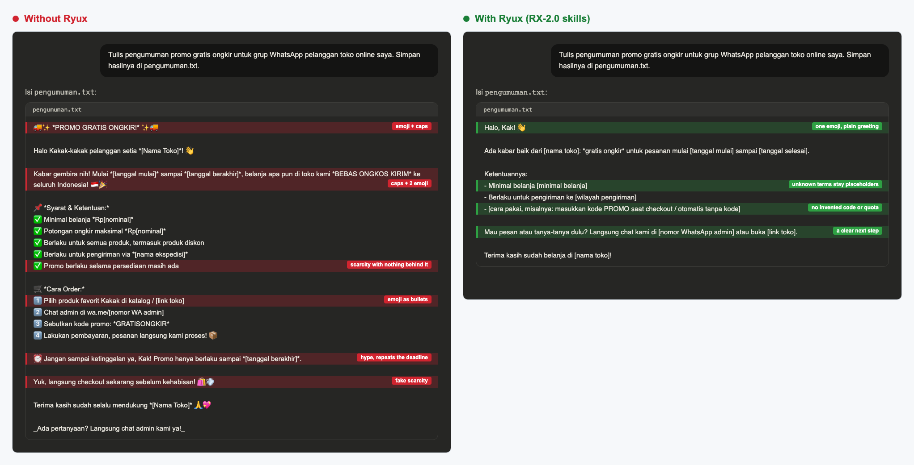
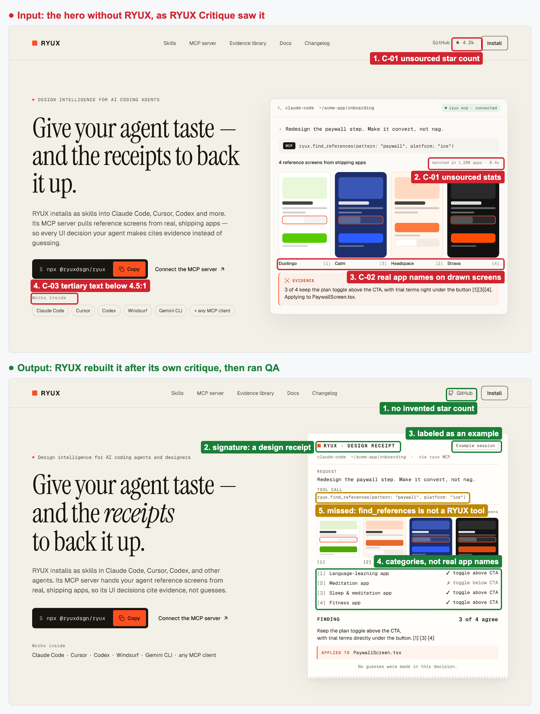
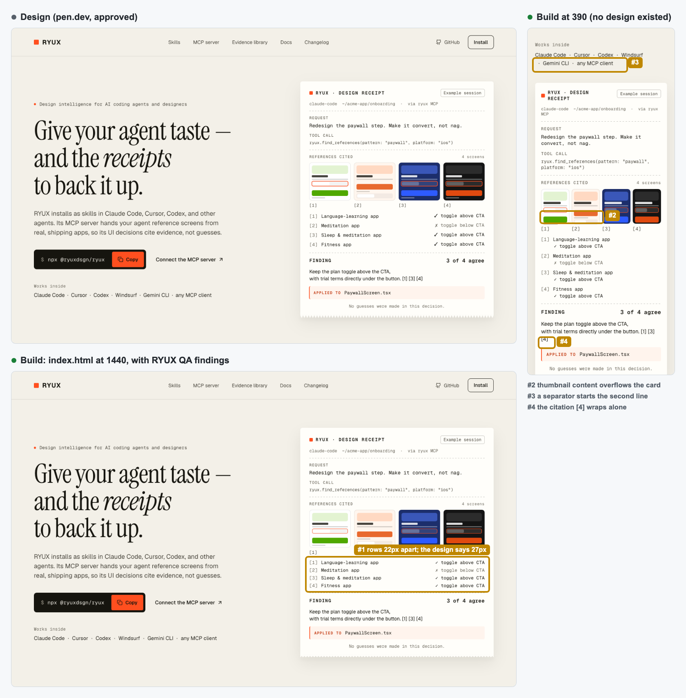
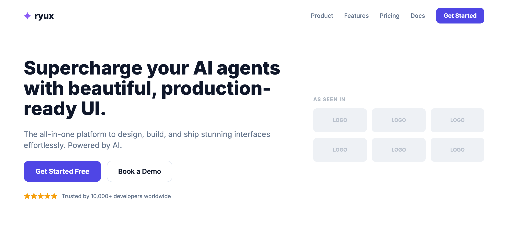
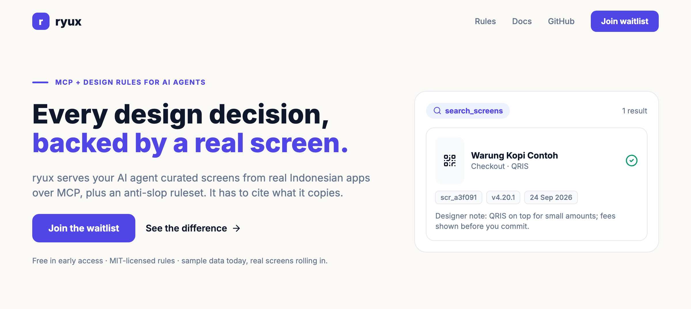

# Before/After Playbook for RYUX (showcase)

A guide to creating 3 **before vs after** comparisons for the README: real proof that RYUX
turns "AI-smelling" output into something grounded and natural. Principle: **honest, not a fake mockup**
(RX-AS-03). "Before" = agent output without RYUX; "After" = the same agent's output **with**
RYUX + the RYUX MCP.

## Setup (one time)

1. Run the local MCP: `pnpm dev:mcp` (reference data at `http://localhost:8787/mcp`).
2. Install the rules in the agent you use: `npx @ryuxdsgn/ryux` (choose Claude Code/Cursor + groups: foundation, ux, ui, engineering, quality).
3. Connect the agent to the MCP: `claude mcp add --transport http ryux-local http://localhost:8787/mcp`.
4. Prepare the assets folder: `assets/compare/{ui,code,chat,copy,a11y,ux,local,review,landing}/`.
5. Capture mobile screens at a width of **390px**; for the README UI image use a **1920×1080** frame. Export as PNG, and name the pairs `before` / `after`.

> Fairness tip: "before" is produced in a session/agent **without** RYUX and **without** the MCP; "after" in a session
> **with** both. The brief is exactly the same. Do not hand-edit the results, so the comparison stays honest.

---

## README headline: one image each for UI, Code, Copy (headless runs)

The README "See the difference" section shows one image per area, each pairing a run without RYUX
and a run with RYUX. Each variant runs headless (`claude -p`) in its own empty folder outside this
repo, so the repo's own `CLAUDE.md` does not leak in:

```bash
# rules on: install the stage skills into the run folder
node packages/cli/dist/cli/index.js install --agent claude
# reference data on: start the local MCP and pass it to the run
pnpm dev:mcp   # then: claude -p "<brief>" --mcp-config mcp.json --strict-mcp-config
```

| Image | Without | With |
| --- | --- | --- |
| `ui/compare.png` | pen.dev MCP only; a RYUX hero with an illustration made by pen.dev's `Generate` | pen.dev MCP + RYUX 2.0 (one skill); no RYUX MCP; same brief; frames exported after the asynchronous illustration arrived |
| `code/compare.png` | no skills | all RYUX 1.3 skills; the agent picks which to load |
| `chat/compare.png` | no skills | all RYUX 1.3 skills; the agent picks which to load |

The UI brief is a hero section for RYUX itself; the code and copy briefs are international (Tally,
an invoicing app for freelancers), because RYUX is not only for the Indonesian market. The Indonesian set (`compare-id.png`) is kept under
[Indonesian market examples](#indonesian-market-examples).

pen.dev's `execute` always targets the open document, so UI runs add one new top-level frame and
export it as a PNG into the run folder. The UI brief asks for the hero section only, so no cropping is needed. Code and copy
output is rendered verbatim in an editor-style and a chat-style page. Pairs are composed into one
image, and the colored boxes are annotations layered on top, never edits to the output.

If a run shows a defect (overflow, covered text), rerun it and pick another run. If every run shows
the same weakness, fix the rule or skill that should have prevented it, then rerun. For the 1.3.1
images, the first code run put Rupiah handling into a global module, so the Indonesian rules were
scoped to products built for that market. For the 1.5 image, a run with 1.5.0 still chose the category default
(copy left, agent session right) and called it a concept, so RX-UI-12 now requires three written
directions and forbids the category default as the signature; the next run chose "Footnoted". Captions only
claim what the image shows.

---

## Use case 1 · UI: payment method picker screen (QRIS checkout)

**Shows:** RX-UI-05, RX-AS-01, RX-AS-03 (no generic patterns or fake data), RX-IX-09 (transparent QRIS),
RX-A11Y-01, RX-A11Y-02 (contrast & touch targets), RX-PR-04 (`screen_id` evidence).

**Steps:**

1. **Before**: in the agent without RYUX, ask:
   > "Build one mobile HTML file (390px wide) for the payment method picker screen of an Indonesian F&B app."
   Save `before.html`, open it in the browser (390px device mode), screenshot → `assets/compare/ui/before.webp`.
2. **After**: in the agent with RYUX + MCP, ask for the same thing plus:
   > "Use the QRIS reference from RYUX (`search_screens` query 'qris'), apply the interaction-design and accessibility stages, do not use fake logos/numbers, cite the `screen_id` in a comment."
   Save `after.html`, screenshot → `assets/compare/ui/after.webp`.
3. **Numeric proof (optional but powerful):** run `audit_ui` on both screens (fill in `tap_target_px`,
   `contrast_ratio`, `states`, and so on). Record the result: *before* FAIL, *after* PASS. This can serve as a caption.

**What you usually see:** before has a sparkle logo + generic methods + thin contrast; after
puts QRIS at the very top with a clear amount, touch targets ≥44px, and no invented data.

---

## Use case 2 · Copy: text & formatting (Rupiah, errors, CTA)

**Shows:** RX-CD-02 (Rupiah), RX-CD-01 (natural Bahasa Indonesia), RX-EC-02 (errors offer a way out),
RX-CD-03 (specific CTA, not a cliché).

**Steps:**

1. **Before**: in the agent without RYUX, ask it to write 4 pieces of text as-is:
   > "Write for a shopping app: (a) the pay button label, (b) the price display for Rp1250000, (c) the message when payment fails, (d) the CTA for a promo banner."
2. **After**: in the agent with RYUX, ask it to fix all four per the `ryux-content` skill, then run
   `audit_copy` to prove it (before has findings, after is clean).
3. Paste both sets onto a single simple card (or screenshot the cleaned-up output directly),
   screenshot → `assets/compare/copy/before.webp` & `after.webp`.

**Target:** `Rp 1250000` → `Rp1.250.000`; "Terjadi kesalahan." → "Pembayaran gagal. Cek koneksi lalu
coba lagi."; "BAYAR SEKARANG" → "Bayar sekarang"; "Pelajari selengkapnya" → "Lihat contoh checkout QRIS".

---

## Use case 3 · Review: shallow critique vs grounded `heuristic_eval`

**Shows:** RYUX Critique + the `heuristic_eval` tool + mandatory `screen_id` evidence.

**Steps:**

1. Take one screen to review (it can be `before.html` from use case 1, or a screenshot of a real app).
2. **Before**: in the agent without RYUX, ask: "Review this screen." You usually get a shallow critique
   ("add white space", "make it more modern"). Screenshot → `assets/compare/review/before.webp`.
3. **After**: in the agent with RYUX installed, ask for a structured review. The agent will
   call `heuristic_eval`, which returns formatted findings: heuristic, severity 0-4, location, recommendation, and
   a comparison `screen_id`. Clean up the output (JSON or a table), screenshot → `assets/compare/review/after.webp`.

**Key contrast:** before = opinion with no evidence; after = prioritized findings with real app examples.

---

## Putting it in the README

Replace/complete the text table in the **"See the difference"** section with images (a pattern like other repos use):

```md
| Before | After |
|:--|:--|
| <a href="assets/compare/ui/before.webp"></a> | <a href="assets/compare/ui/after.webp"></a> |
```

Always fill in a descriptive `alt` (accessibility, RX-A11Y-03). Every image is click-to-enlarge.

## Checklist

- [ ] `assets/compare/ui/before.webp` + `after.webp`
- [ ] `assets/compare/copy/before.webp` + `after.webp`
- [ ] `assets/compare/review/before.webp` + `after.webp`
- [ ] Each pair's caption names the rules (RX-…) and, if available, the `audit_ui`/`audit_copy` result
- [ ] README updated to use images, with descriptive `alt`

## Indonesian market examples

These three pairs were the README examples for rules 1.2, with an Indonesian brief for each. Both
runs used the RYUX rules of that time, and the UI "with" run also had the RYUX MCP for reference
screens.

### UI

*"A 1920×1080 landing page for Catat, a cashier and bookkeeping app for Indonesian UMKM."* Both runs
designed in pen.dev through its MCP. The "with" run also had the ryux MCP for reference screens.

<a href="../assets/compare/ui/compare-id.png"></a>

Both look finished, and that is the trap. Without RYUX, the polish hides invented numbers, a borrowed
face, and the wrong Rupiah format (RX-AS-01, RX-AS-02, RX-CD-02). With RYUX, there is one primary
action (RX-PR-03), the sample data is labeled and adds up (RX-AS-03, RX-QA-04), and the agent closed
with a Delivery Gate that marked its own gap honestly: only the 1920 frame was drawn, so RESPONSIVE
was reported as FAIL.

### Code

*"A TypeScript module that calculates an order total with shipping, an admin fee, and PPN 11%, and
formats it as Rupiah."*

<a href="../assets/compare/code/compare-id.png"></a>

Comments only say why (RX-FE-06). The tax rule nobody specified is marked as an assumption instead of
invented (RX-PR-02, RX-FE-02). Money comes out as `Rp1.250.000`, not `Rp 1.250.000` (RX-FE-12).

### Copy

*"Tulis pengumuman promo gratis ongkir untuk grup WhatsApp pelanggan toko online saya."*

<a href="../assets/compare/chat/compare-id.png"></a>

No emoji bullets or invented scarcity (RX-CD-03, RX-AS-04). Minimums, codes, and quotas the shop never
gave stay placeholders instead of invented terms (RX-PR-02), and the message ends with a clear next
step.

## Earlier demo: a landing-page hero, end to end

This was the README demo before the checkout run. Made with an earlier RYUX release (rules as of then).

One hero section through the whole loop. Every step below is a real agent run with RYUX installed,
quoted as it came out.

**"Analyze this hero, then critique it."** The input is a hero that an agent without RYUX designed.
RYUX inventoried it, then reported 12 findings. The top three are severity 3: unsourced numbers
(RX-AS-01), real app names on drawn screens presented as findings (RX-UI-07), and tertiary text at
3.98:1, below WCAG's 4.5:1 (RX-A11Y-01).

**"Now improve it."** RYUX compared three directions and chose a "design receipt" as the
signature (RX-UI-12). The redesign removes the numbers, labels the session as an example, uses app
categories instead of names, and fixes the contrast.

<a href="../assets/compare/demo/compare.png"></a>

**"Build it."** RYUX built the redesign as one HTML and CSS file from the pen.dev frame's exact
values, responsive down to 390 wide. Links the design did not specify point to `#` instead of
invented URLs.

**"QA it."** RYUX compared the renders with the design: a close match at 1440, with one deviation
(rows 22px apart where the design says 27px), and three defects at 390, where no design existed.
Its Delivery Gate said FAIL until two one-line CSS fixes are made, and listed what it did not
check: hover, focus, and the Copy states.

<a href="../assets/compare/demo/qa.png"></a>

**What it missed, and what we changed.** The made-up tool name `find_references` survived the
first critique; RYUX's real tool is `search_screens`. RYUX 2.1 added a fact check to Critique, and
on the same screen Critique 2.1 listed `find_references` as its first finding, marked
"contradicted".

## Earlier gallery

Earlier pairs built in pen.dev under RX-1.x, one per former install concern. Rule IDs are shown in current numbering.

**`ryux-copy`** · Indonesian copywriting · natural language, Rupiah, error messages

| Before (no ryux) | After (`ryux-copy`) |
|:--|:--|
| <a href="../assets/compare/copy/copy-before.png"></a> | <a href="../assets/compare/copy/copy-after.png"></a> |
| "Payment Failed", a vague message, a technical error code, dollars, a shouting button. | "Pembayaran gagal" with the cause and the fix (RX-CD-04), natural Indonesian (RX-CD-01), Rupiah (RX-CD-02). |

**`ryux-a11y`** · accessibility · contrast, text size, touch targets, focus

| Before (no ryux) | After (`ryux-a11y`) |
|:--|:--|
| <a href="../assets/compare/a11y/a11y-before.png"></a> | <a href="../assets/compare/a11y/a11y-after.png"></a> |
| 11px text at roughly 2:1 contrast, placeholder-only labels, small targets, a washed-out button. | 16px or larger at AA contrast (RX-A11Y-01), targets of 48px and up (RX-A11Y-02), visible focus (RX-A11Y-03). |

**`ryux-ux`** · applied UX patterns (NNGroup) · forms, validation, fewer fields, keypad

| Before (no ryux) | After (`ryux-ux`) |
|:--|:--|
| <a href="../assets/compare/ux/ux-before.png"></a> | <a href="../assets/compare/ux/ux-after.png"></a> |
| Two columns, placeholder labels, everything required, a vague error. | One column with labels above the fields (RX-FM-01, forms guide), inline validation that keeps what you typed (RX-FM-03), fewer fields (forms guide), a numeric keypad (RX-FM-05). |

**`ryux-local`** · Indonesian patterns · QRIS, virtual account, fees, Rupiah

| Before (no ryux) | After (`ryux-local`) |
|:--|:--|
| <a href="../assets/compare/local/local-before.png"></a> | <a href="../assets/compare/local/local-after.png"></a> |
| A global card form, dollars, foreign methods, no local pattern. | A Virtual Account with a copy button and a payment deadline (RX-IX-10), a transparent admin fee (RX-IX-05), and Rupiah. |

**Bonus: usability review over MCP** (`heuristic_eval`, an audit tool rather than an installed stage)

| Before (shallow critique) | After (`heuristic_eval`) |
|:--|:--|
| <a href="../assets/compare/review/review-before.png"></a> | <a href="../assets/compare/review/review-after.png"></a> |
| Opinions, no evidence. | Structured findings: the heuristic, a severity from 0 to 4, a recommendation, and `screen_id` evidence. |

**RYUX's own landing page (we use RYUX on RYUX)** · the honest test

_Without RYUX._ The same product pitched like generic AI slop: a buzzword headline, a "10,000+" with no source, and a fake "AS SEEN IN" logo wall.

<a href="../assets/compare/landing/landing-before.png"></a>

_With `RYUX`._ Designed in pen.dev under its own rules: an editorial layout, one accent, a specific evidence-first headline, and a real `search_screens` result (screen_id, app, version, capture date, designer note) where the slop version put fake logos.

<a href="../assets/compare/landing/landing-after.png"></a>

Real evidence (`scr_a3f091`, app, version, date) in place of a fake logo wall (RX-AS-02): the "after" shows the product's whole point instead of borrowing credibility. Specific over buzzword (RX-CD-03), one accent over default-everything (RX-UI-04), an honest early-access line over an invented "10,000+" (RX-AS-01).

**Design decisions**

| Before | After |
| --- | --- |
| "Put QRIS at the top because it looks good." | "Put QRIS at the top, since that's what Indonesian F&B apps do for small amounts (`scr_demo_001`)." |

`RX-PR-04` rejects any decision that has no `screen_id` behind it, and `delivery_gate` enforces that.

The UI checks that `audit_ui` and `heuristic_eval` run: touch targets of 44px or more (RX-A11Y-02),
contrast of at least 4.5:1 (RX-A11Y-01), and the full set of states, loading, empty, and error
(RX-EC-01). The screens above are built honestly. They're not faked mockups (RX-AS-03).
